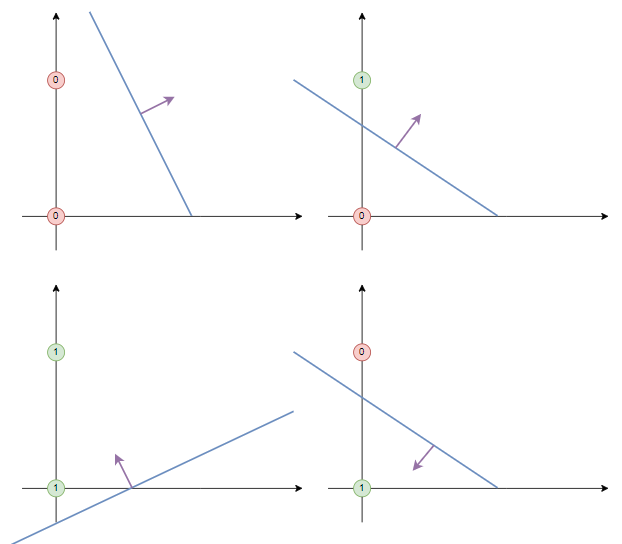
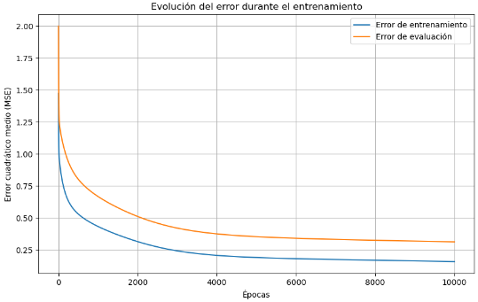

<center>

---

# <font color='darkblue'>TP1 - REDES NEURONALES</font>

---

</center>

- ## Alumno: Lautaro De Lucia
- ## Padrón: 100203
- ## Fecha: 25/11/24


## Introducción

<center>


</center>

- Consideramos un perceptrón de 2 entradas como el de la figura

<center>


</center>

- La ecuación que ilustra su comportamiento es de la forma: 

<center>

#### $\hat{y}_\mu=f(\sum_{i=1}^2\omega_ix^\mu_i+b)$

</center>

- Para este caso, elegimos utilizar la función escalón unitario (step function) como función de activación, ya que sus salidas $1$ y $0$ son consistentes con los estados lógicos ***HIGH*** y ***LOW*** utilizados en compuertas lógicas. Luego, la expresión anterior puede escribirse en notación vectorial, lo que además nos permite generalizar para $N$ entradas

<center>

#### $\hat{y}_\mu=u(\vec{\omega}\vec{x_\mu}+b)$

</center>

- es fácil ver que el hiperplano cuya normal es $\vec{\omega}$ marca la división entre las dos clases de la salida $y_\mu$.

<center>


</center>


- Para el caso de dos dimensiones, obtenemos la ecuación de la ***recta discriminante*** de la expresión anterior. 

<center>

#### $\vec{\omega}.\vec{x}+b=\omega_1x_1+\omega_2x_2+b \rightarrow x_2=-\frac{\omega_1}{\omega_2}x_1-\frac{b}{\omega_2}$

</center>


- Una vez entrenado el perceptrón, esta recta debería tomar una forma como la ilustrada a continuación para AND y OR respectivamente.

<center>


</center>

- Ambos problemas son ***linealmente separables***, por lo que nuestro perceptrón siempre converge a una solución. Como sabemos, la regla de aprendizaje es la siguiente:

<center>

#### $\Delta\vec{\omega}=\eta(y_d-\hat{y})\vec{x}$

</center>

- Siendo $y_d$ el valor deseado, $\hat{y}$ el obtenido, $\eta$ el factor de aprendizaje y $\vec{x}$ las entradas.

- Conceptualmente, en el caso de el perceptrón simple con una única salida binaria, sumar $\Delta\vec{\omega}$ equivale a *reorientar* a $\vec{\omega}$ cada vez que ocurre una clasificación incorrecta en una dirección que busca reducir el error obtenido. 


- Luego, podemos resumir el proceso de entrenamiento de el perceptrón simple de la siguiente forma:
  - Inicializamos los pesos $\vec{\omega}$ y el bias $b$ aleatoriamente.
  - Para cada patrón $\vec{x}_\mu$ del set de entrenamiento.
    - Calculamos la salida $\hat{y}_\mu=u(\vec{\omega}.\vec{x}_\mu + b)$
      - Si hay un error $ (y_d-\hat{y}_\mu) \neq 0 $, actualizamos los pesos $\vec{\omega}$ y el bias $b$ según la regla $\Delta \vec{\omega} = \eta (y_d-\hat{y}_\mu) \vec{x}_\mu $
      - Caso contrario, no se realizan cambios.
    - Repetimos hasta que no haya errores en la clasificación o se llegue a un número máximo de iteraciones (indicativo de que el problema no es linealmente separable y por ende no se converge a una solución). 

  

### Implementación del Perceptrón Simple

- Definimos la clase `SimplePerceptron` con los métodos `train` y `predict`. La función `train` recibe las entradas y salidas esperadas del perceptrón (esto es, el set de entrenamiento), así como el factor de aprendizaje y un máximo número de iteraciones (a modo de contemplar que el problema pueda no ser linealmente separable), y realiza el entrenamiento. El método esta diseñado a modo de ser agnóstico al número de inputs (tanto en cantidad como dimensión). 
  
- Al finalizar su ejecución, los pesos de la red se habrán actualizado. Adicionalmente, se designa un arreglo con el error en cada paso del entrenamiento como otro atributo de la clase. En la medida en que el problema sea linealmente separable, este debería mostrar una tendencia descendente y converger a cero. 

- Por último, la función de activación elegida es la `step`. Se elige deliberadamente que el output sea $1$ o $0$ en lugar de $1$ y $-1$ a modo de que haya una consistencia conceptual con la notación usual de las compuertas lógicas. 


```py

class SimplePerceptron:
    def __init__(self, learning_rate=0.01, max_iterations=1000):
        self.learning_rate = learning_rate
        self.max_iterations = max_iterations
        self.weights = None
        self.bias = None
        self.errors_ = []  # Lista para almacenar los errores por época

    def step_function(self, x):
        """Función escalón unitario"""
        return np.where(x >= 0, 1, 0)

    def train(self, inputs, outputs):
        """Entrena el perceptrón usando el algoritmo descrito y registra los errores"""
        # Inicializamos el número de muestras y características
        num_samples, num_features = inputs.shape

        # Inicializamos los pesos y el bias
        self.weights = np.zeros(num_features)
        self.bias = 0

        # Algoritmo de entrenamiento
        for _ in range(self.max_iterations):
            errors = 0
            for i in range(num_samples):
                # Producto escalar entre los pesos y las entradas
                linear_output = np.dot(inputs[i], self.weights) + self.bias
                predicted_output = self.step_function(linear_output)

                # Actualización de los pesos si hay error
                error = outputs[i] - predicted_output
                if error != 0:
                    self.weights += self.learning_rate * error * inputs[i]
                    self.bias += self.learning_rate * error
                    errors += 1
            # Almacenar el número de errores de esta época
            self.errors_.append(errors)
            # Si no hay errores, terminamos el entrenamiento
            if errors == 0:
                break

    def predict(self, inputs):
        """Realiza predicciones con los pesos entrenados"""
        linear_output = np.dot(inputs, self.weights) + self.bias
        return self.step_function(linear_output)

```

- Adicionalmente, se define una función `plot_decision_boundary` que utiliza los parámetros obtenidos durante el entrenamiento y realiza una gráfica de la recta discriminante así como las entradas correspondientes a cada perceptrón, distinguiendo su clasificación con colores.

```py

    def plot_decision_boundary(self, inputs, outputs, title=''):
        """Grafica la recta discriminante y los datos de entrada"""

        # Verificar que las entradas sean bidimensionales
        if inputs.shape[1] != 2:
            raise ValueError("La función plot_decision_boundary solo soporta entradas de 2 características.")

        # Crear una malla de puntos para graficar la frontera de decisión
        x_min, x_max = inputs[:, 0].min() - 1, inputs[:, 0].max() + 1
        y_min, y_max = inputs[:, 1].min() - 1, inputs[:, 1].max() + 1
        xx, yy = np.meshgrid(np.linspace(x_min, x_max, 200),
                             np.linspace(y_min, y_max, 200))
        grid_points = np.c_[xx.ravel(), yy.ravel()]
        Z = self.predict(grid_points)
        Z = Z.reshape(xx.shape)

        # Crear el gráfico
        plt.figure(figsize=(8, 6))
        plt.contourf(xx, yy, Z, alpha=0.2, cmap=plt.cm.Paired)

        # Graficar los puntos de datos
        scatter = plt.scatter(inputs[:, 0], inputs[:, 1], c=outputs, s=100, edgecolors='k', cmap=plt.cm.Paired, marker='o')

        # Configurar el gráfico
        plt.xlabel('Input 1')
        plt.ylabel('Input 2')
        plt.title(title)
        plt.xlim(xx.min(), xx.max())
        plt.ylim(yy.min(), yy.max())

        # Añadir leyenda
        legend = plt.legend(*scatter.legend_elements(), title="Clases")
        plt.gca().add_artist(legend)

        plt.show()

```

- Finalmente, definimos una función `plot_errors` que simplemente realice un plot de la evolución del error que se obtuvo durante el entrenamiento.

```py

    def plot_errors(self, title='Evolución del error de clasificación'):
        """Grafica la evolución del error de clasificación durante el entrenamiento"""
        plt.figure(figsize=(8, 6))
        plt.plot(range(1, len(self.errors_) + 1), self.errors_, marker='o')
        plt.xlabel('Épochs')
        plt.ylabel('Errores de clasificación')
        plt.title(title)
        plt.grid(True)
        plt.show()


```

### Resultados

- A continuación se muestra el código que hace uso de esta clase a los propósitos de el enunciado así como los resultados de su ejecución. 

- #### AND 2 Entradas

```py

import numpy as np

# Datos para la compuerta AND
inputs_and = np.array([[0, 0], [0, 1], [1, 0], [1, 1]])
outputs_and = np.array([0, 0, 0, 1])

# Crear y entrenar el perceptrón para AND
perceptron_and = SimplePerceptron(learning_rate=0.1, max_iterations=10)
perceptron_and.train(inputs_and, outputs_and)

# Graficar la frontera de decisión para AND
perceptron_and.plot_decision_boundary(inputs_and, outputs_and, title='Frontera de decisión para la compuerta AND')

# Graficar la evolución del error de clasificación
perceptron_and.plot_errors(title='Evolución del error para la compuerta AND')

```

<center>


</center>

- #### OR 2 Entradas

```py

# Datos para la compuerta OR
inputs_or = np.array([[0, 0], [0, 1], [1, 0], [1, 1]])
outputs_or = np.array([0, 1, 1, 1])

# Crear y entrenar el perceptrón para OR
perceptron_or = SimplePerceptron(learning_rate=0.1, max_iterations=10)
perceptron_or.train(inputs_or, outputs_or)

# Graficar la frontera de decisión para OR
perceptron_or.plot_decision_boundary(inputs_or, outputs_or, title='Frontera de decisión para la compuerta OR')

# Graficar la evolución del error de clasificación
perceptron_or.plot_errors(title='Evolución del error para la compuerta OR')

```

<center>


</center>


- Notamos que en ambos casos las rectas discriminantes se grafican correctamente. En ambos casos se comienza con 2 clasificaciones erroneas de 4 y se consigue un error de clasificación de 0 al cabo de 4 iteraciones (el número de interaciones, por supuesto, no tiene por qué ser el mismo). 

- La consigna solicita que hagamos lo mismo para un perceptrón AND y OR de 4 entradas. Podemos usar la misma función `train_simple_perceptron` de antes, modificando los inputs para que reflejen la tablas tablas de verdad $AND$ y $OR$ de 4 entradas respectivamente.

```py

# Generar todas las combinaciones posibles de 4 bits
inputs_4 = np.array([[int(x) for x in f"{i:04b}"] for i in range(16)])

# Compilación de los datos para AND de 4 entradas
outputs_and_4 = np.array([1 if np.all(row) else 0 for row in inputs_4])

# Crear y entrenar el perceptrón para la compuerta AND de 4 entradas
perceptron_and_4 = SimplePerceptron(learning_rate=0.1, max_iterations=20)
perceptron_and_4.train(inputs_4, outputs_and_4)

# Graficar la evolución del error de clasificación para AND
perceptron_and_4.plot_errors(title='Evolución del error para la compuerta AND de 4 entradas')

# Compilación de los datos para OR de 4 entradas
outputs_or_4 = np.array([1 if np.any(row) else 0 for row in inputs_4])

# Crear y entrenar el perceptrón para la compuerta OR de 4 entradas
perceptron_or_4 = SimplePerceptron(learning_rate=0.1, max_iterations=20)
perceptron_or_4.train(inputs_4, outputs_or_4)

# Graficar la evolución del error de clasificación para OR
perceptron_or_4.plot_errors(title='Evolución del error para la compuerta OR de 4 entradas')

```

<center>


</center>

- En donde a pesar de no poder visualizar el *hiperplano discriminante*, si podemos corroborar que el error converge eventualmente a cero, como debe hacerlo por definición en problemas linealmente separables como es el caso de las compuertas AND y OR.


- Sabemos que en la medida en que el patrón a clasificar sea linealmente separable, el perceptrón ***siempre*** va a encontrar una solución en un número finito de pasos, esto es, un conjunto de pesos $\vec{\omega}$ que clasifiquen correctamente cada punto de el patrón. Conversamente, sabemos que en la medida en que el patrón no sea linealmente separable el perceptrón simple ***jamás*** puede converger a una solución. 

- Luego, una definición precisa de la ***capacidad*** del perceptrón, entendida como la cantidad más alta de patrones aleatorios $\mu$ que el perceptron puede aprender para cierta cantidad $n$ de inputs, es la siguiente:

<center>

### $C=\frac{\# \ Problemas \ Linealmente \ Separables}{\# \ Problemas \ Totales}$

</center>

- Siendo $C$ una función de $p$ la cantidad de patrones y $n$ la dimensión de los inputs. 

- Por otro lado, es fácil darse cuenta que para una clasificación binaria la cantidad total de problemas siempre es $2^p$.

- El ejercicio requiere que aproximemos este valor. Puntualmente, en lugar de computar todos los $2^p$ problemas posibles, lo que vamos a hacer es computar $N$ problemas aleatorios, definiendo un estimador $$\hat{C}(p,n)=\frac{\#N_{LS}}{\#N_{T}}\approx C(p,n)$$ eligiendo un valor fijo $n=n_0$ y graficando la variación de $\hat{C}(p,n_0)$ en función de $p$. Si el error luego de entrenar es cero, entonces el problema es linealmente separable y sumo un en $N_{LS}$. 

- Nuestra gráfica debería aproximar el resultado discutido en la teoría.

<center>


</center>

- El cual sostiene $\frac{C(p,n)}{2^p}$ (número de patrones que pueden clasificarse correctamente sobre el total) tiende a 1 (todos los patrones se clasifican correctamente) cuando el número de $p$ patrones es significativamente menor que el número $n$ de inputs, y tiende a 0 cuando $p$ es significativamente mayor. En el límite, cuando $N\rightarrow \infty$, tenemos que $p \approx 2N$, esto es, que la cantidad de patrones que el perceptrón simple puede aprender es exactamente el doble que el número de inputs. 

- Conceptualmente, lo que se esta indicando es que cuanto menor sea el número de patrones a clasificar para un número dado de inputs, mayor es la probabilidad de que la clasificación se lleve a cabo correctamente. Es fácil ver que un perceptrón simple de $n=2$ inputs no tiene problema alguno en clasificar para $p=1$ o $p=2$. Sin embargo, cuando $p=4$ tenemos casos no linealmente separables como la operación $XOR$, resultando en que $\frac{C}{2^p}$ sea distinto de 1.

<center>




</center>


- El algoritmo, entonces, es como sigue:
    - Genero $p$ patrones aleatorios $\vec{x}^\mu \in U(-1,1) \ \land \ y^\mu_d \in Be \{-1,1\}$ con $p=\frac{1}{2}$.
    - Entreno el perceptrón y resuelvo para cada uno.
    - Si aprendió correctamente, sumamos uno.
    - Divido problemas aprendidos por problemas totales para estimar la capacidad.

- Para ello, nos podemos valer de la clase SimplePerceptron definida en el ejercicio 1. Definimos un método `estimate_capacity` que reciba el número de inputs a la entrada y devuelva dos listas, una con $\frac{p}{N}$ y otra con la capacidad estimada $\hat{C}(N,p)$ 
 

```py

    def simulate_capacity(self, N, num_experiments=100):
        """
        Estima la capacidad C(N, p) para valores de p desde 1 hasta 4*N.

        Parámetros:
            N: Cantidad de Inputs
            num_experiments: Número de experimentos aleatorios por valor de p (por defecto 100).

        Devuelve:
            p_over_N_list: Lista de valores p/N.
            capacity_list: Lista de estimaciones de C(N, p).
        """
        max_p = int(4 * N)
        p_values = range(1, max_p + 1)
        capacity_list = []
        p_over_N_list = []

        for p in p_values:
            separable_count = 0
            for _ in range(num_experiments):
                # Generar entradas aleatorias
                inputs = np.random.uniform(-1, 1, (p, N))
                # Generar etiquetas aleatorias (0 o 1)
                outputs = np.random.choice([0, 1], size=p)

                # Entrenar el perceptrón
                self.train(inputs, outputs)

                # Verificar si el perceptrón separa perfectamente los datos
                predictions = self.predict(inputs)
                if np.array_equal(predictions, outputs):
                    separable_count += 1

            # Calcular la fracción de conjuntos linealmente separables
            capacity = separable_count / num_experiments
            capacity_list.append(capacity)
            p_over_N_list.append(p / N)

        return p_over_N_list, capacity_list

```

- Hacemos uso de este método para generar el gráfico de $\frac{\hat{C}}{\frac{p}{N}}$

```py

import numpy as np
import matplotlib.pyplot as plt

# Valores de N a considerar
N_values = [2, 5, 10, 20]

# Crear una instancia del perceptrón
perceptron = SimplePerceptron(learning_rate=0.1, max_iterations=100)

# Configurar el número de experimentos
num_experiments = 100

# Colores y estilos para el gráfico
colors = ['r', 'g', 'b', 'm']
styles = ['-o', '-s', '-^', '-d']

plt.figure(figsize=(10, 6))

for N, color, style in zip(N_values, colors, styles):
    # Simular la capacidad para el valor actual de N
    p_over_N_list, capacity_list = perceptron.simulate_capacity(N, num_experiments=num_experiments)
    # Graficar los resultados
    plt.plot(p_over_N_list, capacity_list, style, color=color, label=f'N = {N}')

# Configurar el gráfico
plt.xlabel('p / N')
plt.ylabel('C(N, p)')
plt.title('Estimación de la capacidad C(N, p) del perceptrón')
plt.legend()
plt.grid(True)
plt.show()


```

- A continuación, se muestran las gráficas obtenidas para $N=\{2,5,10,20\}$

<center>


</center>


- Donde puede corroborarse que efectivamente, a medida que $N$ crece el gráfico se aproxima más a la forma derivada teóricamente. 

<center>


</center>

#### Introducción

- Por simplicidad, vamos a considerar un perceptrón de 2 capas, cuya estructura se ilustra a continuación. 

<center>


</center>

- Donde claramente tenemos 2 neuronas en la primera capa (input layer) y una neurona en la segunda capa (output layer). Consideramos 2 entradas para cada neurona así como un término de bias. En los 3 casos, se elige una ***sigmoide*** como función de activación.


- A pesar de su sencillez, sabemos dado lo visto en clase que teóricamente un perceptrón como el de la figura ***es suficiente*** para vencer el obstáculo de la separabilidad lineal que impone la XOR de 4 entradas. 

<center>


</center>

#### Mecanismo de Aprendizaje

- La ecuación para este perceptrón toma la forma: $$z=f(\sum_iv_i\textcolor{blue}{y_i}+c)=f(\sum_iv_i \ \textcolor{blue}{f(\sum_jx_j\omega_{ij}+b_i)}+c)$$

- El error sigue definiendose de la misma forma: $$E=\frac{1}{2}(z_d-z)^2$$

- Y el aprendizaje consiste en implementar ***back-propagation*** para los pesos de estas 3 neuronas.
    - En la output layer:
        $$\Delta v_i=-\eta\frac{dE}{dv_i}=\eta\sum_\mu(z_d-\textcolor{blue}{z})g'(\textcolor{blue}{\sum_iv_iy_i + c})y_i$$
    - En la input layer: 
        $$\Delta\omega_{ij}=-\eta\frac{dE}{d\omega_{ij}}=\eta\sum_\mu(z_d-z)g'(\sum_iv_i\textcolor{green}{y_i}+c)v_ig'(\textcolor{green}{\sum_j{\omega_{ij}x_j}+b_i})x_j$$

- Dada la consigna, queremos hacer una implementación que nos permita generalizar el perceptrón de la figura a cualquier número de entradas. Para ello es fácil observar que la sumatoria previamente expresada puede representarse en términos de álgebra lineal. Considerando nuestros 2 inputs:

\[ H_1 = \begin{bmatrix} x_1 & x_2 \end{bmatrix} \cdot \begin{bmatrix} \omega_{11} & \omega_{21} \\ \omega_{12} & \omega_{22} \end{bmatrix} + \begin{bmatrix} b_{1} \\ b_{2} \end{bmatrix} \]

\[ y = g(H_1) \]

\[ H_2 = g(H_1) \cdot \begin{bmatrix} v_{1} \\ v_{2} \end{bmatrix} + c_1 \]

\[ z = g(H_2) \]

- Donde $H_1$ es la suma ponderada de los inputs en la hidden layer, $H_2$ es la suma ponderada de las salidas de la hidden layer en la output layer, y $g$ es la función sigmoide.

- Generalizado para cualquier cantidad de inputs, tenemos las ecuaciones matriciales:

\[ H_1 = \vec{x} \cdot W + \vec{b} \]
\[ \vec{y} = g(H_1) \]
\[ H_2 = \vec{y} \cdot V + c \]
\[ z = g(H_2) \]

- Lo cual nos permite reformular el gradiente de el error en cada capa en término de estas expresiones

\[ \Delta V = -\eta \frac{dE}{dV} = \eta \sum_{\mu} (z_d - z) g'(H_2) \vec{y} \]
\[ \Delta W = -\eta \frac{dE}{dW} = \eta \sum_{\mu} (z_d - z) g'(H_2) V g'(H_1) \vec{x} \]

#### Implementación 

- Definimos entonces una clase `TwoLayerPerceptron` análoga a nuestro `SimplePerceptrón` utilizado en los primeros 2 ejercicios, donde ahora los métodos de aprendizaje y predicción se ajustan a la estructura descrita en la sección anterior de este mismo ejercicio. 

```py

class TwoLayerPerceptron:
    def __init__(self, input_size, input_layer_size=2, learning_rate=0.1, max_epochs=100000):
        self.input_size = input_size  # Número de entradas
        self.input_layer_size = input_layer_size  # Número de neuronas en la capa oculta
        self.learning_rate = learning_rate
        self.max_epochs = max_epochs
        self.error_cut_condition = 0.005

        # Inicialización de pesos y bias para la capa oculta
        self.W = np.random.uniform(-1, 1, (self.input_size, self.input_layer_size))
        self.b_input_layer = np.random.uniform(-1, 1, (1, self.input_layer_size))

        # Inicialización de pesos y bias para la capa de salida
        self.V = np.random.uniform(-1, 1, (self.input_layer_size, 1))
        self.b_output = np.random.uniform(-1, 1, (1, 1))

        # Lista para almacenar el error en cada época
        self.errors_ = []

    def sigmoid(self, x):
        """Función de activación sigmoide"""
        return 1 / (1 + np.exp(-x))

    def sigmoid_derivative(self, x):
        """Derivada de la función sigmoide"""
        return x * (1 - x)

    def train(self, X, y):
        """Entrena la red neuronal usando el algoritmo de backpropagation con condición de corte"""
        for epoch in range(self.max_epochs):
            # FORWARD PASS
            # Capa oculta
            input_layer_input = np.dot(X, self.W) + self.b_input_layer  # H_1 = X * W + b_input_layer
            input_layer_output = self.sigmoid(input_layer_input)        # y = g(H_1)

            # Capa de salida
            final_input = np.dot(input_layer_output, self.V) + self.b_output  # H_2 = y * V + b_output
            final_output = self.sigmoid(final_input)                     # z = g(H_2)

            # BACKWARD PASS
            # Calcular el error
            error = y - final_output                                     # Error en la salida
            mse = np.mean(np.square(error))                              # Error cuadrático medio

            # Almacenar el error actual
            self.errors_.append(mse)

            # Condición de corte: detener si el ECM es menor a 0.005
            if mse < self.error_cut_condition:
                print(f"Entrenamiento detenido en el epoch {epoch + 1} debido a que el ECM alcanzó {mse:.6f}")
                break

            # Calcular el delta en la capa de salida
            delta_output = error * self.sigmoid_derivative(final_output)  # δ_o = (z_d - z) * g'(H_2)

            # Calcular el delta en la capa oculta
            delta_input_layer = delta_output.dot(self.V.T) * self.sigmoid_derivative(input_layer_output)  # δ_h = δ_o * V^T * g'(H_1)

            # Actualizar los pesos y biases
            # Actualizar V y b_output (capa de salida)
            self.V += self.learning_rate * input_layer_output.T.dot(delta_output)
            self.b_output += self.learning_rate * np.sum(delta_output, axis=0, keepdims=True)

            # Actualizar W y b_input_layer (capa oculta)
            self.W += self.learning_rate * X.T.dot(delta_input_layer)
            self.b_input_layer += self.learning_rate * np.sum(delta_input_layer, axis=0, keepdims=True)

    def predict(self, X):
        """Realiza predicciones usando la red neuronal entrenada"""
        # Capa oculta
        input_layer_input = np.dot(X, self.W) + self.b_input_layer
        input_layer_output = self.sigmoid(input_layer_input)

        # Capa de salida
        final_input = np.dot(input_layer_output, self.V) + self.b_output
        final_output = self.sigmoid(final_input)

        # Convertir la salida a 0 o 1
        return np.where(final_output >= 0.5, 1, 0)

    def plot_errors(self, title='Evolución del error durante el entrenamiento'):
        """Grafica la evolución del error cuadrático medio durante el entrenamiento"""
        plt.figure(figsize=(8, 6))
        plt.plot(range(1, len(self.errors_) + 1), self.errors_, marker='o')
        plt.xlabel('Épocas')
        plt.ylabel('Error cuadrático medio')
        plt.title(title)
        plt.grid(True)
        plt.show()

``` 

- A continuación, se muestra la evolución del error para el perceptrón de 2 capas 

```py

# Datos de entrada y salida para XOR de 2 entradas
X_2 = np.array([[0, 0],
                [0, 1],
                [1, 0],
                [1, 1]])

y_2 = np.array([[0],
                [1],
                [1],
                [0]])

# Crear una instancia del perceptrón de dos capas
perceptron_2 = TwoLayerPerceptron(input_size=2, input_layer_size=2, learning_rate=0.5, max_epochs=10000)

# Entrenar el perceptrón
perceptron_2.train(X_2, y_2)

# Graficar la evolución del error
perceptron_2.plot_errors(title='Evolución del error para XOR de 2 entradas')

# Realizar predicciones
predictions_2 = perceptron_2.predict(X_2)
print("Predicciones para XOR de 2 entradas:")
print(predictions_2.T)

# Verificar las predicciones
print("Salidas deseadas:")
print(y_2.T)


```


```py

# Generar todas las combinaciones posibles de 4 bits
X_4 = np.array([[int(x) for x in f"{i:04b}"] for i in range(16)])

# Definir la salida de la función XOR de 4 entradas
# La salida es 1 si el número de unos es impar, 0 si es par
y_4 = np.array([[1 if np.sum(row) % 2 != 0 else 0] for row in X_4])

# Crear una instancia del perceptrón de dos capas con más neuronas en la capa de entrada
perceptron_4 = TwoLayerPerceptron(input_size=4, input_layer_size=4, learning_rate=0.5, max_epochs=100000)

# Entrenar el perceptrón
perceptron_4.train(X_4, y_4)

# Graficar la evolución del error
perceptron_4.plot_errors(title='Evolución del error para XOR de 4 entradas')

# Realizar predicciones
predictions_4 = perceptron_4.predict(X_4)
print("Predicciones para XOR de 4 entradas:")
print(predictions_4.T)

# Verificar las predicciones
print("Salidas deseadas:")
print(y_4.T)

```


#### Introducción

- Dada la idéntidad entre el primer y segundo inciso en cuanto a implementación, vamos a proceder a definir una red neuronal con 30 neuronas intermedias, 3 inputs y 1 output. Nos valemos de la ambiguedad de el término "capa-oculta" a modo de simplificar la implementación, postulando a los inputs de la red como los valores $(x,y,z)$, ingresando estos directamente a la capa de 30 neuronas. De este modo, no tener que implementar una capa intermedia adicional entre estos inputs y la capa de 30 neuronas (lo que en el ejercicio anterior hubiesemos llamado el *input layer* o *capa de entrada*).

<center>


</center>

- Al mismo tiempo, generamos un set de entrenamiento de $40$ muestras $\vec{v}=(x,y,z)$, donde $x,y \in U(0,2\pi)$ y $z=U(0,1)$. El entrenamiento se hace por back-propagation, comparando la salida deseada, obtenida de la función $f(x,y,z)=\sin(x)+\cos(y)+z$, con la salida obtenida por la red. 

- Siendo la metodología de entrenamiento la misma (al márgen de que como el resultado es continuo no podemos usar una función de activación binaria optando por una sigmoide en ambas capas), omitimos los detalles teóricos, los cuales fueron explicados en el ejercicio anterior, para concentrarnos en lo que distingue a este ejercicio. Puntualmente:
    - En primer lugar, queremos comparar los resultados para ***entrenamiento en batch*** y ***entrenamiento en mini-batch o estocástico***. En nuestro caso y dada la consigna, el mini-batch va a tener tamaño $1$ y el batch va a tener tamaño $40$. 
    - En segundo lugar, aunque en la consigna solo se menciona el error de entrenamiento, estamos bastante seguros de que en clase se hizo mención a evaluar el *overfitting* de la red. Siendo esto así, vamos a construir un set de testeo de $100$ muestras y vamos a evaluar el error cuadrático medio de la red en este set (Usualmente, el set de testeo es más chico que el de entrenamiento. Sin embargo, juzgamos que un set con, digamos, $10$ muestras no nos va a permitir hacer una evaluación fideligna de la diferencia entre nuestra red y la función original (se corre más riesgo de muestrear outliers).

#### Implementación

- Comenzamos por generar nuestro set de entrenamiento y testeo

```py

import numpy as np
import matplotlib.pyplot as plt

# Generar el conjunto de entrenamiento (40 muestras)
N_train = 40
x_train = np.random.uniform(0, 2 * np.pi, N_train)
y_train = np.random.uniform(0, 2 * np.pi, N_train)
z_train = np.random.uniform(-1, 1, N_train)
f_train = np.sin(x_train) + np.cos(y_train) + z_train

# Preparar las entradas y salidas para el entrenamiento
X_train = np.column_stack((x_train, y_train, z_train))
y_train = f_train.reshape(-1, 1)

# Generar el conjunto de evaluación (200 muestras)
N_test = 100
x_test = np.random.uniform(0, 2 * np.pi, N_test)
y_test = np.random.uniform(0, 2 * np.pi, N_test)
z_test = np.random.uniform(-1, 1, N_test)
f_test = np.sin(x_test) + np.cos(y_test) + z_test

# Preparar las entradas y salidas para la evaluación
X_test = np.column_stack((x_test, y_test, z_test))
y_test = f_test.reshape(-1, 1)


```

- Definimos una clase MLP que implementa la red neuronal descrita en el apartado anterior. Como se notará, nuestra clase respeta el formato de las clases definidas en ejercicios anteriores. En particular, nuestro metodo 'train' ahora va recibir el set de testeo, ya que queremos evaluar la evolución de el error sobre este set a medida que se entrena el modelo. Asimismo, se agrega el batch_size como un parámetro del método.  

```py

class MLP:
    def __init__(self, input_size=3, hidden_size=30, output_size=1, learning_rate=0.01, max_epochs=1000):
        self.input_size = input_size  # Número de entradas
        self.hidden_size = hidden_size  # Número de neuronas en la capa oculta
        self.output_size = output_size  # Número de neuronas en la capa de salida
        self.learning_rate = learning_rate
        self.max_epochs = max_epochs

        # Inicialización de pesos y bias para la capa oculta
        self.W = np.random.uniform(-0.5, 0.5, (self.input_size, self.hidden_size))
        self.b_hidden = np.zeros((1, self.hidden_size))

        # Inicialización de pesos y bias para la capa de salida
        self.V = np.random.uniform(-0.5, 0.5, (self.hidden_size, self.output_size))
        self.b_output = np.zeros((1, self.output_size))

        # Listas para almacenar los errores por época
        self.train_errors = []
        self.test_errors = []

    def sigmoid(self, x):
        """Función de activación sigmoide"""
        return 1 / (1 + np.exp(-x))

    def sigmoid_derivative(self, x):
        """Derivada de la función sigmoide"""
        return x * (1 - x)

    def train(self, X_train, y_train, X_test, y_test, batch_size=1):
        """Entrena la red neuronal utilizando backpropagation con soporte para minibatches"""
        n_samples = X_train.shape[0]
        for epoch in range(self.max_epochs):
            # Mezclar los datos de entrenamiento al inicio de cada época
            indices = np.arange(n_samples)
            np.random.shuffle(indices)
            X_train = X_train[indices]
            y_train = y_train[indices]

            for start in range(0, n_samples, batch_size):
                end = start + batch_size
                X_batch = X_train[start:end]
                y_batch = y_train[start:end]

                # FORWARD PASS
                # Capa oculta
                hidden_input = np.dot(X_batch, self.W) + self.b_hidden  # H_1 = X * W + b_hidden
                hidden_output = self.sigmoid(hidden_input)              # y = g(H_1)

                # Capa de salida (lineal)
                final_input = np.dot(hidden_output, self.V) + self.b_output  # H_2 = y * V + b_output
                final_output = final_input                                   # z = H_2 (función de activación lineal)

                # BACKWARD PASS
                # Calcular el error
                error = y_batch - final_output                              # Error en la salida

                # Calcular el delta en la capa de salida
                delta_output = error                                        # δ_o = (y_d - z)

                # Calcular el delta en la capa oculta
                delta_hidden = delta_output.dot(self.V.T) * self.sigmoid_derivative(hidden_output)  # δ_h = δ_o * V^T * g'(H_1)

                # Actualizar los pesos y biases
                # Actualizar V y b_output (capa de salida)
                self.V += self.learning_rate * hidden_output.T.dot(delta_output) / batch_size
                self.b_output += self.learning_rate * np.sum(delta_output, axis=0, keepdims=True) / batch_size

                # Actualizar W y b_hidden (capa oculta)
                self.W += self.learning_rate * X_batch.T.dot(delta_hidden) / batch_size
                self.b_hidden += self.learning_rate * np.sum(delta_hidden, axis=0, keepdims=True) / batch_size

            # Evaluar el error en el conjunto de entrenamiento y testeo
            train_output = self.predict(X_train)
            train_error = np.mean((y_train - train_output) ** 2)
            self.train_errors.append(train_error)

            test_output = self.predict(X_test)
            test_error = np.mean((y_test - test_output) ** 2)
            self.test_errors.append(test_error)

            # Mostrar el error cada 100 épocas
            if (epoch + 1) % 100 == 0:
                print(f"Época {epoch + 1}/{self.max_epochs}, Error de entrenamiento: {train_error:.6f}, Error de evaluación: {test_error:.6f}")

    def predict(self, X):
        """Realiza predicciones usando la red neuronal entrenada"""
        # Capa oculta
        hidden_input = np.dot(X, self.W) + self.b_hidden
        hidden_output = self.sigmoid(hidden_input)

        # Capa de salida (lineal)
        final_input = np.dot(hidden_output, self.V) + self.b_output
        final_output = final_input  # Función de activación lineal

        return final_output

    def plot_errors(self):
        """Grafica la evolución del error de entrenamiento y evaluación"""
        plt.figure(figsize=(10, 6))
        plt.plot(self.train_errors, label='Error de entrenamiento')
        plt.plot(self.test_errors, label='Error de evaluación')
        plt.xlabel('Épocas')
        plt.ylabel('Error cuadrático medio (MSE)')
        plt.title('Evolución del error durante el entrenamiento')
        plt.legend()
        plt.grid(True)
        plt.show()

```

- Graficamos la evolución del error para los tamaños de batche explicitados en la consigna. 

```py

# Entrenamiento con batch completo
print("Entrenamiento con batch completo (tamaño de minibatch = 40):")
nn = MLP(learning_rate=0.01, max_epochs=1000)
nn.train(X_train, y_train, X_test, y_test, batch_size=40)
nn.plot_errors()

# Entrenamiento con minibatch de tamaño 1
print("\nEntrenamiento con minibatch de tamaño 1 (estocástico):")
nn_stochastic = MLP(learning_rate=0.01, max_epochs=1000)
nn_stochastic.train(X_train, y_train, X_test, y_test, batch_size=1)
nn_stochastic.plot_errors()

```


<center>

#### Entrenamiento en Batch


#### Entrenamiento en Mini-Batch o Estocástico


</center>

- Además, en clase se solicitó comparar la salida deseada con la salida real de el modelo en un gráfico cartesiano, donde naturalmente el criterio de la precisión de el modelo es cuanto el gráfico resultante se aproxime a la receta $y=x$. 

```py

y_pred = nn.predict(X_test)

# Gráfico salida real vs salida deseada
plt.figure(figsize=(8, 6))
plt.scatter(y_test, y_pred, c='blue', label='Datos')
plt.plot([y_test.min(), y_test.max()], [y_test.min(), y_test.max()], 'r--', label='Salida deseada = Salida real')
plt.xlabel('Salida deseada')
plt.ylabel('Salida real')
plt.title('Comparación entre la salida deseada y la salida real (Batch completo)')
plt.legend()
plt.grid(True)
plt.show()

y_pred_stochastic = nn_stochastic.predict(X_test)

# Gráfico salida real vs salida deseada
plt.figure(figsize=(8, 6))
plt.scatter(y_test, y_pred_stochastic, c='green', label='Datos')
plt.plot([y_test.min(), y_test.max()], [y_test.min(), y_test.max()], 'r--', label='Salida deseada = Salida real')
plt.xlabel('Salida deseada')
plt.ylabel('Salida real')
plt.title('Comparación entre la salida deseada y la salida real (Minibatch = 1)')
plt.legend()
plt.grid(True)
plt.show()

```


#### Observaciones y Conclusiones

- A continuación, discutimos los resultados inmediatamente observables en nuestra implementación y tratamos de explicar sus motivos e implicaciones.
  - ***Para ambos casos el error disminuye gradualmente con cada época***, lo que indica que el modelo está aprendiendo correctamente y ajustando sus pesos para minimizar el error cuadrático medio.
  - Ahora bién, ***las curvas de evolución de el error presentan una varianza notablemente mayor en el caso de el entrenamiento estocástico***. Estas fluctuacions son esperables dado que en el entrenamiento estocástico cada actualización de los pesos se basa en una sola muestra, resultando en que el gradiente calculado es una estimación ruidosa del gradiente real. 
  - Notablemente, ***el error resulta menor tanto en términos absolutos como en términos de la diferencia entre el error de entrenamiento y error de testeo para el caso de entrenamiento estocástico***. Entendemos que esto se debe precisamente a que el entrenamiento estocástico actúa como una forma de regularización, ayudando al modelo a generalizar mejor. Coloquialmente, el *ruido* que introducimos en el gradiente está ayudando a que este no se "atasque" en mínimos locales poco profundos y de esa forma se explore más ampliamente el espacio de parámetros. 
  - Lo mismo sucede en cuanto a la comparación entre la salida deseada y la real, en la cual ***el modelo estocástico obtiene mejores resultados***. Esto se condice con que el error absoluto disminuya más rápido en el caso estocástico. Presumiblemente,la mayor frecuencia de actualización de el caso estocástico permite al modelo adaptarse más rápidamente a las características de los datos, aunque esto ocurra de forma "ruidosa". 
  - Por último, se aumento el número de epochs con el objeto de evaluar si el error de testeo crecía en algún punto de el entrenamiento, lo cual constituiría la prueba más clara de ***overfitting***. Esto efectivamente ocurrió ligeramente, pero notablemente ***solo para el entrenamiento estocástico***. Vemos que, como es esperado por lo descrito en los incisos anteriores, el error de entrenamiento estocástico eventualmente alcanza un mínimo absoluto (error cero) y ajusta perfectamente los datos de entrenamiento. Ahora bién, ***como estos datos de entrenamiento son muy pocos, que el modelo se ajuste perfectamente a ellos no es algo bueno***, ya que implica que es altamente probable que el modelo no generalice bien sobre nuevos datos, que es lo que refleja un error de testeo que conspicuamente comienza a subir en el punto en que el error de entrenamiento se vuelve nulo. 
  - En términos de la estructura de nuestra red, especulamos que el hecho de que tenga 30 neuronas en la capa oculta dota al modelo de una gran capacidad. En el entrenamiento estocástico, dado el escueto tamaño del set de entrenamiento, esta capacidad se utiliza para ajustar el modelo a cada muestra individual, resultando en un ajuste perfecto sobre datos de entrenamiento pero poco generalizable. En el entrenamiento batch, en cambio, el modelo está forzado a encontrar una solución que minimice el error promedio sobre todas las muestras, lo que puede actuar como una forma de regularización y prevenir el overfitting.

<center>




</center>


#### Introducción

- El modelo básico de una RBM se ilustra a continuación. Consiste de una ***capa visible*** $\vec{v}$ que representa los datos observables (en nuestro caso, los píxeles de una imágen) y una ***capa oculta*** $\vec{h}$ de menor dimensión, y que conceptualmente codifica *dependencias* entre las capas visibles. 

<center>


</center>

- Toda RBM involucra una ***función de energía*** $E(V,H)$, (siendo $V=\{v_1,...,v_n\}$ y $H=\{h_1,...,h_m\}$) la cual es una medida de la probabilidad conjunta de $V$ y $H$. Conceptualmente, podemos decir que una menor energía representa una mayor *compatibilidad* entre dos activaciones concretas $V_o$ y $H_o$. Queda claro, entonces, que teniendo una función de energía bién definida podemos obtener una reconstrucción $\hat{V}$ a partir de $H$.

- Este es un caso de aprendizaje no supervisado, en donde el modelo se entrena a los fines de aprender a reconstruir sus propias entradas, ajustando sus pesos y sesgos para minimizar la diferencia entre las entradas originales y las reconstrucciones.

- En clase se pidio implementar una versión simplificada con las siguientes características:
  - $V=\{v_1,...,v_n\}$, donde $v_i \sim N(m_i,1)$ representando $m_i$ la intensidad del pixel.
  - $H=\{h_1,...,h_m\}$, donde $h_j \sim Be(p)$ con $p=\sigma(\sum_i v_i w_{ij}+b_j)$ siendo $\sigma(x)=\frac{1}{1+e^{-x}}$
  - A partir de ambas, obtenemos los datos $(v_i,h_j)_D$
  - Donde es claro que nuestra reconstrucción $\hat{V}=\{\hat{v}_i,...,\hat{v}_n\}$ se obtiene como $\hat{v}_i \sim N(\hat{m}_i,1)$ con $\hat{m}_i=\sum_j h_j w_{ij}+b_i$. De esta forma obtenemos las reconstrucciones $(v_i,h_j)_R$
  - Las actualizaciones de pesos y biases para el entrenamiento son entonces: 
    - $\Delta \omega_{ij} = \eta(<(v_i,h_j)_D> -<(v_i,h_j)_R>)$
    - $\Delta b_i = \eta(<(v_i)_D>-<(v_i)_R>)$
    - $\Delta b_j = \eta(<(h_j)_D>-<(h_j)_R>)$

#### Implementación

- Utilizamos pytorch como medio de fácil descarga del dataset MNIST, aunque convertimos a numpy para no usarlo en la implementación. 


```py 

from torchvision import datasets, transforms
import numpy as np
import matplotlib.pyplot as plt

# Descargar MNIST y convertirlo a tensores
mnist_train = datasets.MNIST(
    root="./data", train=True, download=True, transform=transforms.ToTensor()
)

mnist_test = datasets.MNIST(
    root="./data", train=False, download=True, transform=transforms.ToTensor()
)

# Convertir los datos a NumPy
x_train = mnist_train.data.numpy()  
y_train = mnist_train.targets.numpy()  

x_test = mnist_test.data.numpy()  
y_test = mnist_test.targets.numpy() 

# Normalizar las imágenes (entre 0 y 1)
x_train = x_train / 255.0
x_test = x_test / 255.0

print(f"Tamaño del dataset de entrenamiento: {x_train.shape}")
print(f"Tamaño del dataset de prueba: {x_test.shape}")


```

- Notese que estamos normalizando las imágenes de el set de datos deliberadamente a pesar de que lo discutido en clase parece insinuar que $v_i \in \{0,255\}$. El intento inicial de implementar el código con los datos sin normalizar llevo a malos resultados que se juzga son producto de valores iniciales muy grandes en las activaciones. El usar valores normalizados dio resultados satisfactorios, y el único cambio que estos implican respecto a la consigna es corregir la varianza en la normal por un factor de escala de 255.

- Definimos nuestra clase RBM que implementa los algoritmos discutidos en la sección anterior. Dado el tamaño de el dataset MNIST, el cual volvió el prohibitivo el entrenamiento, se opto por actualizar los pesos y sesgos en batches de tamaño 100, lo cual permitió una convergencia más rápida al tiempo que mostro mejores resultados que reducir el dataset deliberadamente. 

```py

class RBM:
    def __init__(self, n_visible, n_hidden, learning_rate=0.01):
        self.n_visible = n_visible  # Número de unidades visibles (28x28 = 784)
        self.n_hidden = n_hidden  # Número de unidades ocultas
        self.learning_rate = learning_rate

        # Inicializar pesos y sesgos
        self.W = np.random.randn(n_visible, n_hidden) * 0.01  # Pesos pequeños
        self.b = np.zeros(n_visible)  # Sesgos de la capa visible
        self.c = np.zeros(n_hidden)  # Sesgos de la capa oculta

    def sigmoid(self, x):
        return 1 / (1 + np.exp(-x))

    def v_to_h(self, v):
        """Sample hidden units given visible units."""
        activation = np.dot(v, self.W) + self.c
        h_prob = self.sigmoid(activation)
        h_sample = np.random.binomial(1, h_prob)
        return h_sample

    def h_to_v(self, h):
        """Sample visible units given hidden units."""
        mean = np.dot(h, self.W.T) + self.b  # Mean of Gaussian
        v_sample = np.random.normal(mean, 1/255)  # Sample from Gaussian with mean and variance 0.01
        return v_sample

    def contrastive_divergence(self, v0):
        """Perform one step of Contrastive Divergence."""
        # Positive phase
        h0_sample = self.v_to_h(v0)
        D = np.dot(v0.T, h0_sample)

        # Negative phase
        m1 = self.h_to_v(h0_sample)  # Use mean values
        m1 = np.clip(m1, 0, 1)  # Ensure values are within [0, 1]

        h1_sample = self.v_to_h(m1)
        R = np.dot(m1.T, h1_sample)

        # Update weights and biases
        batch_size = v0.shape[0]
        self.W += self.learning_rate * (D - R) / batch_size
        self.b += self.learning_rate * np.mean(v0 - m1, axis=0)
        self.c += self.learning_rate * np.mean(h0_sample - h1_sample, axis=0)

        # Compute reconstruction error
        error = np.mean((v0 - m1) ** 2)
        return error

    def train(self, data, epochs=10, batch_size=100):
        errors = []
        for epoch in range(epochs):
            np.random.shuffle(data)
            epoch_error = 0
            for i in range(0, data.shape[0], batch_size):
                batch = data[i : i + batch_size]
                error = self.contrastive_divergence(batch)
                epoch_error += error
            errors.append(epoch_error / (data.shape[0] // batch_size))
            print(f"Epoch {epoch + 1}/{epochs}, Error: {errors[-1]:.4f}")
        return errors

    def reconstruct(self, v):
        h_sample = self.v_to_h(v)
        m_recon = self.h_to_v(h_sample)
        m_recon = np.clip(m_recon, 0, 1)  # Ensure values are within [0, 1]
        return m_recon

```

- A partir de este código, evaluamos las reconstrucciones, eligiendo como una compresión razonable una cantidad de neuronas en la capa oculta 4 veces menor a la cantidad de neuronas en la capa visible. 

```py

# Aplanar las imágenes de entrenamiento
x_train_flat = x_train.reshape(-1, 784)

# Entrenar la RBM con datos continuos
rbm = RBM(n_visible=784, n_hidden=int((784/4)), learning_rate=0.01)
errors = rbm.train(x_train_flat, epochs=10, batch_size=100)

# Tomar algunas imágenes de prueba
sample_images = x_test[:10]  # 10 imágenes de prueba

# Aplanar imágenes de prueba para reconstrucción
sample_images_flat = sample_images.reshape(-1, 784)

# Reconstrucción
v_recon = rbm.reconstruct(sample_images_flat)
reconstructed_images = v_recon.reshape(-1, 28, 28)

# Visualizar originales y reconstruidas
fig, axes = plt.subplots(2, 10, figsize=(20, 4))
for i in range(10):
    # Original
    axes[0, i].imshow(sample_images[i], cmap="gray")
    axes[0, i].axis("off")
    # Reconstruida
    axes[1, i].imshow(reconstructed_images[i], cmap="gray")
    axes[1, i].axis("off")
plt.show()


```

<center>


</center>


#### Conclusiones y Observaciones 

- Las reconstrucciones resultan satisfactorias, siendo que ningún dígito se confunde con otro, al márgen de la pérdida de calidad en la imagen.


