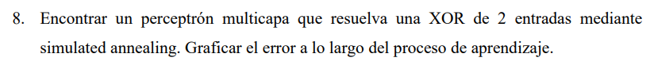
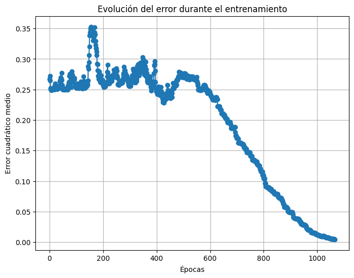
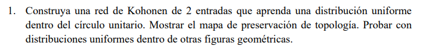
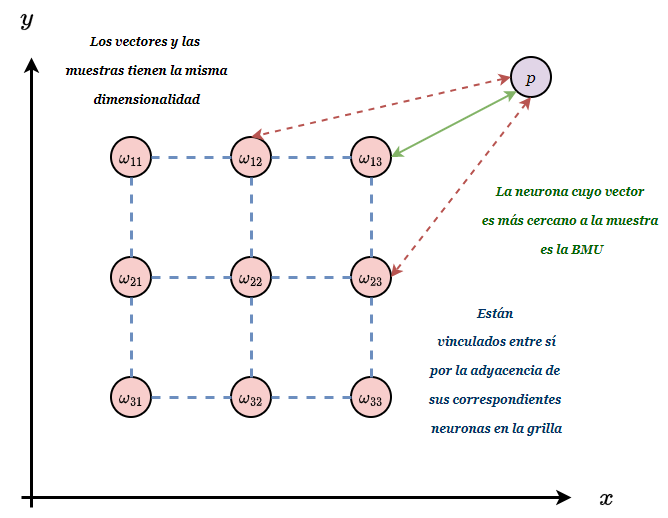
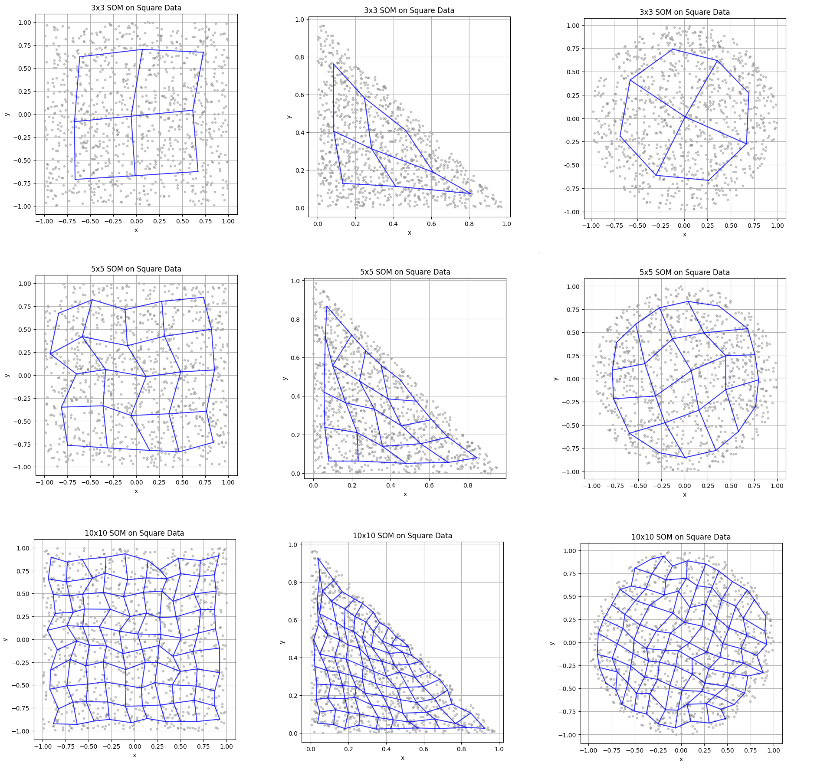

- Simulated Annealing es un algoritmo de optimización que pretende encontrar el mínimo de una función. En el caso de el perceptrón, estamos tratando de minimizar el error.
  
- El algoritmo consiste en tomar valores pseudo-aleatorios en el espacio de soluciones. Decimos pseudo-aleatorios por que si bién la obtención de valores se hace de manera aleatoria, la aceptación de los valores se basa en una regla probabilística de la forma: 

<center>

#### $p=e^{-\frac{\Delta E(\vec{\omega})}{T}}$

</center>

- Donde $\Delta E(\vec{\omega})$ es la diferencia de energía entre la solución actual y la solución propuesta. Si $\Delta E(\vec{\omega}) \leq 0$ se acepta la solución propuesta, si $\Delta E(\vec{\omega}) > 0$ se acepta la solución propuesta con probabilidad $p$.

- Cuando la solución se acepta, se actualiza el estado actual con la solución propuesta y se procede a perturbar la solución propuesta para obtener una nueva solución. Existe más de una regla de perturbación, y nosotros nos vamos a quedar con la que se explicó en clase, según la cual: 

<center>

#### $\Delta w_i \sim N(0,\sigma^2)$

</center>

- Por otro lado, la temperatura $T$ es un hiperparámetro que se va reduciendo en cada iteración según una regla de enfriamiento

<center>

#### $T_{k+1} = \alpha T_k \ \ \ 0 < \alpha < 1$

</center>

- La idea es que al principio seamos más tolerantes con las perturbaciones que aumentan la energía y que a medida que avanzamos en el tiempo, seamos más exigentes, a los fines de poder llegar a explorar todo el espacio de soluciones. 

- En otras palabras, la probabilidad de aceptación de un estado peor que el actual disminuye con el tiempo. Esto es lo que permite explorar el espacio de soluciones inicialmente al tiempo que cerca de el final se converge a un mínimo. 


- Como el problema a resolver es sencillo, vamos a implementar el perceptrón multicapa más sencillo posible que desarrollamos en el segundo ejercicio del TP2, modificando el algoritmo de entrenamiento para que utilice Simulated Annealing.


```py

import numpy as np
import matplotlib.pyplot as plt

class TwoLayerPerceptronSA:
    def __init__(self, input_size, input_layer_size=2, initial_temperature=1.0, cooling_rate=0.99, max_epochs=100000):
        self.input_size = input_size  # Número de entradas
        self.input_layer_size = input_layer_size  # Número de neuronas en la capa oculta
        self.initial_temperature = initial_temperature
        self.cooling_rate = cooling_rate
        self.max_epochs = max_epochs
        self.error_cut_condition = 0.005

        # Inicialización de pesos y biases como matrices y vectores separados
        # Pesos y bias para la capa oculta
        self.W = np.random.uniform(-1, 1, (self.input_size, self.input_layer_size))
        self.b_input_layer = np.random.uniform(-1, 1, (1, self.input_layer_size))

        # Pesos y bias para la capa de salida
        self.V = np.random.uniform(-1, 1, (self.input_layer_size, 1))
        self.b_output = np.random.uniform(-1, 1, (1, 1))

        # Lista para almacenar el error en cada época
        self.errors_ = []

    def sigmoid(self, x):
        """Función de activación sigmoide"""
        return 1 / (1 + np.exp(-x))

    def compute_error(self, X, z, W, b_input_layer, V, b_output):
        """Calcula el error cuadrático medio dado un conjunto de pesos y biases"""

        # FORWARD PASS
        # Capa oculta
        input_layer_input = np.dot(X, W) + b_input_layer
        input_layer_output = self.sigmoid(input_layer_input)

        # Capa de salida
        final_input = np.dot(input_layer_output, V) + b_output
        final_output = self.sigmoid(final_input)

        # Calcular el error
        error = z - final_output
        mse = np.mean(np.square(error))
        return mse

    def perturb_parameters(self, W, b_input_layer, V, b_output, sigma=0.1):
        """Genera nuevos pesos y biases perturbando ligeramente los actuales con una distribución normal"""
        new_W = W + np.random.normal(0, sigma, size=W.shape)
        new_b_input_layer = b_input_layer + np.random.normal(0, sigma, size=b_input_layer.shape)
        new_V = V + np.random.normal(0, sigma, size=V.shape)
        new_b_output = b_output + np.random.normal(0, sigma, size=b_output.shape)
        return new_W, new_b_input_layer, new_V, new_b_output

    def train(self, X, z):
        """Entrena la red neuronal usando Simulated Annealing con perturbaciones normales"""
        # Inicializar temperatura
        T = self.initial_temperature

        # Evaluar el error inicial
        current_W = self.W
        current_b_input_layer = self.b_input_layer
        current_V = self.V
        current_b_output = self.b_output

        current_error = self.compute_error(X, z, current_W, current_b_input_layer, current_V, current_b_output)

        for epoch in range(self.max_epochs):
            # Generar nueva solución candidata perturbando los pesos y biases actuales
            candidate_W, candidate_b_input_layer, candidate_V, candidate_b_output = self.perturb_parameters(
                current_W, current_b_input_layer, current_V, current_b_output
            )

            # Calcular el error de la nueva solución
            candidate_error = self.compute_error(X, z, candidate_W, candidate_b_input_layer, candidate_V, candidate_b_output)

            # Calcular diferencia de energía (error)
            delta_E = candidate_error - current_error

            # Decidir si aceptamos la nueva solución
            if delta_E <= 0:
                # Aceptamos la nueva solución porque es mejor
                current_W = candidate_W
                current_b_input_layer = candidate_b_input_layer
                current_V = candidate_V
                current_b_output = candidate_b_output
                current_error = candidate_error
            else:
                # Aceptamos con probabilidad p
                p = np.exp(-delta_E / T)
                if np.random.rand() < p:
                    current_W = candidate_W
                    current_b_input_layer = candidate_b_input_layer
                    current_V = candidate_V
                    current_b_output = candidate_b_output
                    current_error = candidate_error

            # Almacenar el error actual
            self.errors_.append(current_error)

            # Condición de corte: detener si el ECM es menor a 0.005
            if current_error < self.error_cut_condition:
                print(f"Entrenamiento detenido en la época {epoch + 1} debido a que el ECM alcanzó {current_error:.6f}")
                break

            # Enfriamiento: actualizar la temperatura
            T = T * self.cooling_rate

            # Opcional: mostrar progreso cada cierto número de épocas
            if (epoch + 1) % 1000 == 0:
                print(f"Época {epoch + 1}, Error: {current_error:.6f}, Temperatura: {T:.6f}")

        # Al finalizar, actualizar los pesos y biases de la red
        self.W = current_W
        self.b_input_layer = current_b_input_layer
        self.V = current_V
        self.b_output = current_b_output

    def predict(self, X):
        """Realiza predicciones usando la red neuronal entrenada"""
        # FORWARD PASS
        # Capa oculta
        input_layer_input = np.dot(X, self.W) + self.b_input_layer
        input_layer_output = self.sigmoid(input_layer_input)

        # Capa de salida
        final_input = np.dot(input_layer_output, self.V) + self.b_output
        final_output = self.sigmoid(final_input)

        # Convertir la salida a 0 o 1
        return np.where(final_output >= 0.5, 1, 0)

    def plot_errors(self, title='Evolución del error durante el entrenamiento'):
        """Grafica la evolución del error cuadrático medio durante el entrenamiento"""
        plt.figure(figsize=(8, 6))
        plt.plot(range(1, len(self.errors_) + 1), self.errors_, marker='o')
        plt.xlabel('Épocas')
        plt.ylabel('Error cuadrático medio')
        plt.title(title)
        plt.grid(True)
        plt.show()

```

- Testeando para la XOR de 2 entradas 


```py

import numpy as np

X = np.array([
    [0, 0],
    [0, 1],
    [1, 0],
    [1, 1]
])

z = np.array([[0], [1], [1], [0]])

perceptron = TwoLayerPerceptronSA(input_size=2)

perceptron.train(X, z)

predictions = perceptron.predict(X)

print("Input:\n", X)
print("Expected Output:\n", z.flatten())
print("Predicted Output:\n", predictions.flatten())

perceptron.plot_errors()


```







- Una ***Red de Kohonen*** o ***Mapa Auto-Organizado*** es un método de aprendizaje no supervisado que, de forma similar a PCA, busca una reducción en la dimensionalidad del problema. El objetivo último es que las neuronas acaben "especializándose" en representar distintas regiones del espacio de datos, manteniendo una coherencia topológica (cuanto más cercanas sean las neuronas en la rejilla, mas símil es su activación ante una entrada específica).

- Conceptualmente, la red actúa como una *grilla* de neuronas de dimensión $MxM$. Cada nodo en esta grilla tendrá asociado vector de pesos con la misma dimensionalidad que el espacio de datos. Dada la consigna, este es un vector en $R^2$. 


- Para cada muestra de datos, la red busca la neurona cuyo vector de pesos esté más cercano a la entrada actual (medido por una distancia, habitualmente Euclidiana). Esta neurona se llama "Unidad de Mejor Correspondencia" o BMU (Best Matching Unit).

- Una vez identificada la BMU, no solo se ajustan los pesos de esa neurona para que se parezcan más al dato que estamos presentando, sino que también se actualizan los pesos de las neuronas vecinas a la BMU en la cuadrícula. Al principio del entrenamiento, esta "vecindad" es amplia para que la red se organice globalmente y con el tiempo se va reduciendo, refinando la organización.

<center>



</center>

- Durante el entrenamiento, tanto la tasa de aprendizaje ($\eta$) como el tamaño efectivo de la vecindad ($\sigma$) van disminuyendo. Al principio, se hacen cambios grandes y se ajustan muchas neuronas. Luego, a medida que se entrena más, el ajuste se vuelve más sutil y localizado.


<center>


</center>

- Para la implementación decidimos crear una clase SOM (Self-Organizing-Map) que reciba el tamaño de la grilla en su inicialización, con un método `train` que recibe los datos a ajustar y un método `plot` para mostrar el estado de la red al finalizar el entrenamiento. 


```py

class SOM:
    def __init__(self, M, data, epochs=100, eta=0.5, eta_final=0.01, sigma=3.0, sigma_final=0.1):
        """
        Inicializar el SOM.
        
        Parámetros:
        - M: int, tamaño de la rejilla (M x M)
        - data: arreglo de numpy de forma (N, 2), los datos de entrada
        - epochs: int, número de épocas de entrenamiento
        - eta: float, tasa de aprendizaje inicial
        - eta_final: float, tasa de aprendizaje final (disminuye linealmente)
        - sigma: float, radio de vecindad inicial
        - sigma_final: float, radio de vecindad final (disminuye linealmente)
        """
        self.M = M
        self.data = data
        self.epochs = epochs
        self.eta = eta
        self.eta_final = eta_final
        self.sigma = sigma
        self.sigma_final = sigma_final
        
        # Inicializar los pesos
        self.W = np.random.uniform(-0.01, 0.01, (M*M, 2))
    
    def train(self):
        """
        Entrenar el SOM usando los datos proporcionados.
        """
        N = self.M * self.M
        for epoch in range(self.epochs):
            np.random.shuffle(self.data)
            current_eta = linear_anneal(self.eta, self.eta_final, epoch, self.epochs-1)
            current_sigma = linear_anneal(self.sigma, self.sigma_final, epoch, self.epochs-1)
            
            for x in self.data:
                # Encontrar la Unidad de Mejor Correspondencia (BMU)
                dists = np.sqrt(((self.W - x)**2).sum(axis=1))
                bmu_idx = np.argmin(dists)
                
                # Coordenadas de la BMU en la rejilla
                bmu_i = bmu_idx // self.M
                bmu_j = bmu_idx % self.M
                
                # Actualizar vecinos
                for i in range(self.M):
                    for j in range(self.M):
                        dist_sq = (i - bmu_i)**2 + (j - bmu_j)**2
                        h = math.exp(-dist_sq / (2 * current_sigma**2))
                        idx = i*self.M + j
                        self.W[idx] += current_eta * h * (x - self.W[idx])
    
    def plot(self, ax=None, show_data=True, title=None):
        """
        Graficar la rejilla del SOM junto con los datos.
        
        Parámetros:
        - ax: Un objeto Axes de matplotlib (opcional). Si es None, se crea una nueva figura.
        - show_data: bool, indicar si se muestran los puntos de datos subyacentes
        - title: str, título de la gráfica
        """
        if ax is None:
            fig, ax = plt.subplots(figsize=(6,6))
        
        # Reestructurar W en una rejilla
        W_x = self.W[:,0].reshape(self.M, self.M)
        W_y = self.W[:,1].reshape(self.M, self.M)
        
        if show_data:
            ax.scatter(self.data[:,0], self.data[:,1], s=10, alpha=0.4, color='gray', label='Datos')
        
        # Graficar la rejilla del SOM
        # Dibujar líneas horizontales
        for r in range(self.M):
            ax.plot(W_x[r, :], W_y[r, :], color='blue', alpha=0.8)
        # Dibujar líneas verticales
        for c in range(self.M):
            ax.plot(W_x[:, c], W_y[:, c], color='blue', alpha=0.8)
        
        ax.set_xlabel('x')
        ax.set_ylabel('y')
        if title is not None:
            ax.set_title(title)
        ax.axis('equal')
        ax.grid(True)
        plt.show()


```

- Se crearon funciones para generar distintos datos de prueba en la forma de figuras geométricas

```py

def generate_square_data(num_points=1000):
    # Generar puntos uniformemente dentro de un cuadrado. Por ejemplo: [-1,1]x[-1,1].
    x = np.random.uniform(-1, 1, num_points)
    y = np.random.uniform(-1, 1, num_points)
    return np.column_stack((x, y))

# Generar puntos de datos a partir de una distribución circular
def generate_circle_data(num_points=1000):
    # Generar ángulos y radios uniformes para obtener puntos dentro de un círculo unitario
    angles = np.random.uniform(0, 2*np.pi, num_points)
    radii = np.sqrt(np.random.uniform(0, 1, num_points))
    x = radii * np.cos(angles)
    y = radii * np.sin(angles)
    return np.column_stack((x, y))

def generate_triangle_data(num_points=1000):
    # Generar puntos uniformemente dentro del triángulo con vértices (0,0), (1,0), (0,1)
    # Un método común: tomar dos números aleatorios u y v de uniforme(0,1),
    # si u+v>1, reflejarlos (u->1-u, v->1-v) para asegurar distribución uniforme en el triángulo.
    u = np.random.uniform(0,1,num_points)
    v = np.random.uniform(0,1,num_points)
    # Enmascarar donde u+v > 1, reflejar esos puntos
    mask = (u+v > 1)
    u[mask] = 1 - u[mask]
    v[mask] = 1 - v[mask]

    # Ahora (u,v) están uniformemente distribuidos en el triángulo formado por (0,0), (1,0), (0,1)
    x = u
    y = v
    return np.column_stack((x, y))


```

- Se generaron distintos gráficos utilizando el mismo formato de inicialización, entrenamiento y ploteo.

```py 

som = SOM(M=3, data=generate_{type}_data(num_points=1000), epochs=100)
som.train()
som.plot(title="MxM SOM on {type} Data")

```

- Los resultados para distintas figuras y distintos tamaños de grilla se muestran a continuación, donde se ve que la forma se ajusta correctamente y se logra un mejor ajuste al incrementar el tamaño de la grilla.




