<center>

---

# <font color='darkblue'>TP1 - REDES DE HOPFIELD</font>

---

</center>

- #### Alumno: Lautaro De Lucía
- #### Legajo: 100203
- #### Fecha de Entrega: 02/10/2024


<center>

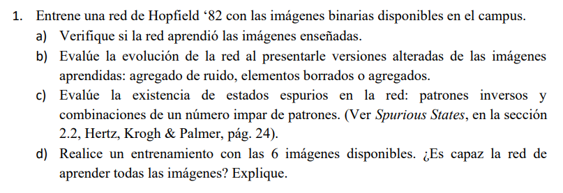

</center>

## Introducción 

- Las redes de Hopfield son un tipo de red neuronal recurrente, donde las neuronas están conectadas entre sí de forma completa y simétrica.

<center>

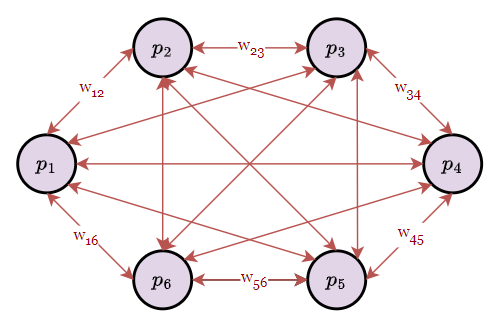

</center>

- Estan basadas en un modelo de *memoria asociativa*, donde se busca almacenar patrones de entrada en la red y recuperarlos a partir de un patrón incompleto o ruidoso.

- En el caso de imágenes binarias, cada píxel de la imágen se representa como una neurona en la red, donde los valores de los píxeles son -1 o 1 para negro y blanco, respectivamente. 

<center>

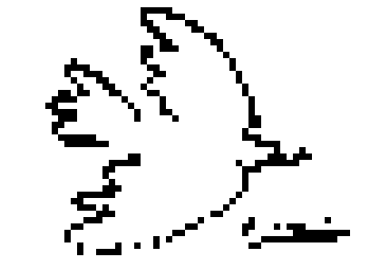

</center>

- Queda claro, entonces, que la función de activación para las neuronas de este tipo de red es la función signo. 

<center>

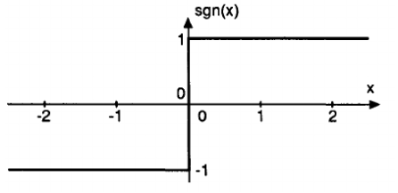

</center>

- En este sentido, el significado de una red de hopfield que ha sido *entrenada* a partir de una imágen es el siguiente: Si ponemos una imágen muy parecida como input de la red (esto es, que difiere tan solo en un par de píxeles), los pesos van a *empujar* a los píxeles disidentes a los valores de la imágen con la que fue entrenada. 


<center>

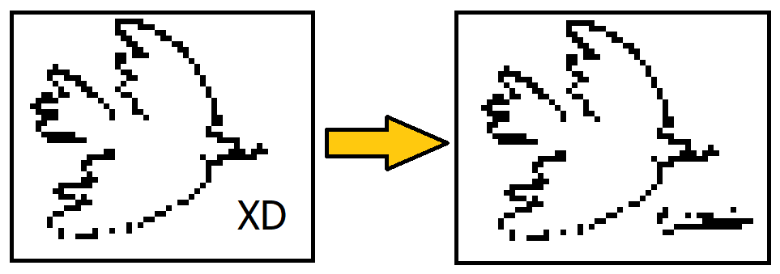

</center>

- Formalmente, dado un patrón $P=\{p_1,...,p_n\}$, donde $p_k=\{-1,1\}$, el patrón es estable en la red si se respeta: 

<center>

#### $$sgn(\sum_{j}^{}{\omega_{ij}p_j})=p_i \ \forall \ i$$

</center>

- Aún no hemos descrito, sin embargo, la forma de obtener estos pesos a partir de el patrón (la regla de entrenamiento). Formalmente, la idea es la siguiente.

#### $$\omega_{ij} \propto p_ip_j$$

- Donde $\omega_{ij}$ es el peso entre las neuronas $i$ y $j$, y $p_i$ y $p_j$ son los valores de los píxeles correspondientes. Conceptualmente, *los pesos estan almacenando información sobre qué neuronas deben activarse juntas*. 

- A modo de ejemplo: Supongamos que tenemos un patrón $P=\{p_1,p_2,p_3,p_4,p_5\}=\{-1,1,1,-1,1\}$. ¿Podemos predecir el valór de $p_5$ a partir de $p_1,p_2,p_3$ y $p_4$? Con la condición de arriba, esta claro que $\omega_{51} = (p_1.p_5) <0 , \ \omega_{52} = (p_2.p_5) >0, \ \omega_{53} = (p_3.p_5) >0 \ \omega_{54} = (p_4.p_5)  < 0$. Luego, esta claro que la activación de un $p_5$ desconocido va a ser positiva. 

- Por supuesto, esto es para un solo patrón. La regla no se modifica significativamente si tenemos más patrones, simplemente sumamos los pesos. Es decir, $\omega_{ij}$ ahora resulta de la superposición de las relaciones entre patrones. Por supuesto, la superposición de un nuevo patrón *agrega información* a la red, la cual, dado que la capacidad de la red es la misma, implica estar substrayendo información de patrones anteriores. En suma, la adición de muchos patrones limita la eficiencia de la red en predecir cada uno. 

- Formalizamos la regla de entrenamiento de la siguiente forma:
  - Dado un conjunto de patrones de entrada $P=\{p_1,...,p_n\}$, donde $p_k=\{-1,1\}$, la matriz de pesos $\omega$ se define como: $$\omega_{ij}=\frac{1}{N}\sum_{P}^{}{p_i^P p_j^P}$$
  - Donde $N$ es el número de neuronas y $P$ es el patrón evaluandose en ese momento. 
  - Donde resulta más que claro que esta sumatoria puede expresarse como un producto matricial. La matriz de pesos va a ser simétrica (representando las conexiones bidireccionales) y tendra ceros en su diagonal (representando la ausencia de autoconexiones) $$W = \frac{1}{N} (P^TP) - I$$

- El entrenamiento consiste en obtener esta matriz de pesos, y la inferencia consiste en obtener un patrón a partir de un patrón de entrada empleando esta matriz. 

- Por último, cabe mencionar que la inferencia puede llevarse a cabo de forma sincrónica o asincrónica.
  - ***Sincrónica:*** Todas las neuronas actualizan su estado simultaneamente. Cada neurona calcula su nuevo estado basándose en los estados en $t$ de todas las otras neuronas. Si el estado de la red en un tiempo $t$ viene dado por $S(t)={s_1,...,s_n}$, entonces el estado de la red en el tiempo $t+1$ viene dado por: $$S(t+1)=sgn(W S(t))$$
  - ***Asincrónica:*** Los pesos se actualizan uno a la vez. Cada neurona actualiza su estado basándose en los estados más recientes de las demás neuronas, lo que incluye las actualizaciones ya realizadas en ese mismo ciclo. Si el estado de la red en un tiempo $t$ viene dado por $S(t)={s_1,...,s_n}$, entonces el estado de la red en el tiempo $t+1$ viene dado por: $$s_i(t+1)=sgn(W S(t))  \ \forall \ i \in \{1,...,N\}$$

## A. Verificación de las Imágenes

#### Observaciones Preliminares

- Las imágenes binarias disponibles en el campus se muestran a continuación.

<center>

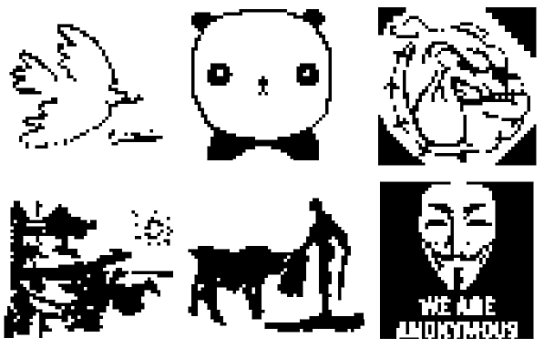

</center>

- Donde puede distinguirse que las dimensiones de las imágenes no son las mismas. 

```py
Code:
# Obtener imágenes BMP en este directorio
images = [f for f in os.listdir('.') if f.endswith('.bmp')]
# Imprimir Dimensiones de las Imágenes
for img in images:
    img_data = io.imread(img)
    print('Dimensiones de la Imagen:', img, img_data.shape)
```

```py
Output:
Dimensiones de la Imagen: paloma.bmp (45, 60)
Dimensiones de la Imagen: panda.bmp (50, 50)
Dimensiones de la Imagen: perro.bmp (50, 50)
Dimensiones de la Imagen: quijote.bmp (45, 60)
Dimensiones de la Imagen: torero.bmp (45, 60)
Dimensiones de la Imagen: v.bmp (50, 50)
```

- Dado el enunciado, resulta evidente que no es necesario entrenar la red con todas las imágenes a los propósitos del primer inciso, por lo que se opto por crear dos batches de imágenes, uno con las imágenes de 50x50 y otro con las imágenes de 45x60.

```py
# Crear Batch de Imágenes de 50x50
images_50 = [f for f in os.listdir('.') if f.endswith('.bmp') and io.imread(f).shape == (50, 50)]
# Crear Batch de Imágenes de 45x60
images_45_60 = [f for f in os.listdir('.') if f.endswith('.bmp') and io.imread(f).shape == (45, 60)]
```

#### Programación de la Red de Hopfield

- Se opto por definir una clase 'HopfieldNetwork', con métodos `train` y `predict` (utilizamos la terminología habitual para entrenamiento e inferencia en Aprendizaje Estadístico y Aprendizaje Profundo). 
  - El método `train` se encarga de entrenar la red a partir de un conjunto de imágenes en formato de matriz de numpy. 
  - El método `predict` se encarga de predecir una imagen a partir de un patrón de entrada, nuevamente en formato de matriz de numpy.
  
EL formato de estos métodos se corresponde, como se notará, con lo elucidado en la introducción teórica.

```py

import numpy as np

class HopfieldNetwork:
    def __init__(self):
        self.W = None  # Matriz de Pesos
        self.P_shape = None # Dimensiones de la Imágen

    def f(self, h):
        # Función de activación	
        # En nuestro caso, la función signo
        return np.where(h >= 0, 1, -1)

    def train(self, patterns):
        # Obtener número de patrones y tamaño de los patrones. Convertir matriz de numpy a lista de numpy arrays
        num_patterns = len(patterns)
        flattened_patterns = [p.flatten() for p in patterns]
        N = flattened_patterns[0].size  
        
        # Inicializamos matriz de pesos 
        self.W = np.zeros((N, N))
        # Guardamos la forma oríginal de la imágen
        self.P_shape = patterns[0].shape          
        # Actualización de pesos
        for p in flattened_patterns:
            self.W += (np.outer(p, p)/N)
        # Eliminamos autoconexiones
        np.fill_diagonal(self.W, 0)

    def predict(self, pattern, synchronous=True, max_epochs=100):
        # Convertimos de matriz a arreglo
        S = pattern.copy().flatten()
        # Preparamos la iteración
        prev_S = np.zeros_like(S)
        epoch = 0
        
        if synchronous:
            # Actualización sincrónica
            while not np.array_equal(S, prev_S) and epoch < max_epochs:
                prev_S = S.copy()
                h = np.dot(self.W, S)
                S = self.f(h)
                epoch += 1
        else:
            # Actualización asincrónica
            indices = np.arange(len(S))
            while not np.array_equal(S, prev_S) and epoch < max_epochs:
                prev_S = S.copy()
                np.random.shuffle(indices)
                for i in indices:
                    h = np.dot(self.W[i, :], S)
                    S[i] = self.f(h)
                epoch += 1
        
        # Convertimos el output a matriz y deolvemos
        return S.reshape(self.P_shape)

```

- Como los patrones de input y output de esta red son matrices de numpy, es necesario convertir nuestras imágenes a este formato: 

```py
# Crear Batch de Imágenes de 50x50
images_50 = [f for f in os.listdir('.') if f.endswith('.bmp') and io.imread(f).shape == (50, 50)]
images_50_np = []

for image in images_50:
    img = Image.open(image).convert('L')
    img_array = np.array(img)
    binary_array = np.where(img_array > 127, 1, -1)
    images_50_np.append(binary_array)  

# Crear Batch de Imágenes de 45x60
images_45_60 = [f for f in os.listdir('.') if f.endswith('.bmp') and io.imread(f).shape == (45, 60)]
images_45_60_np = []

for image in images_45_60:
    img = Image.open(image).convert('L')
    img_array = np.array(img)
    binary_array = np.where(img_array > 127, 1, -1)
    images_45_60_np.append(binary_array)  
```

- Para cada patrón respectivamente:

```py

network = HopfieldNetwork()
network.train(input_patterns)
output_patterns = [network.predict(pattern, synchronous=True) for pattern in input_patterns]

import matplotlib.pyplot as plt

fig, axes = plt.subplots(3, 2, figsize=(10, 15))

for i in range(3):
    axes[i, 0].imshow(input_patterns[i], cmap='gray')
    axes[i, 0].set_title(f'Test Pattern {i+1}')
    axes[i, 0].axis('off')
    
    axes[i, 1].imshow(output_patterns[i], cmap='gray')
    axes[i, 1].set_title(f'Converged Pattern {i+1}')
    axes[i, 1].axis('off')

plt.tight_layout()
plt.show()


```

<center>

#### Resultados Batch 45x50

</center>

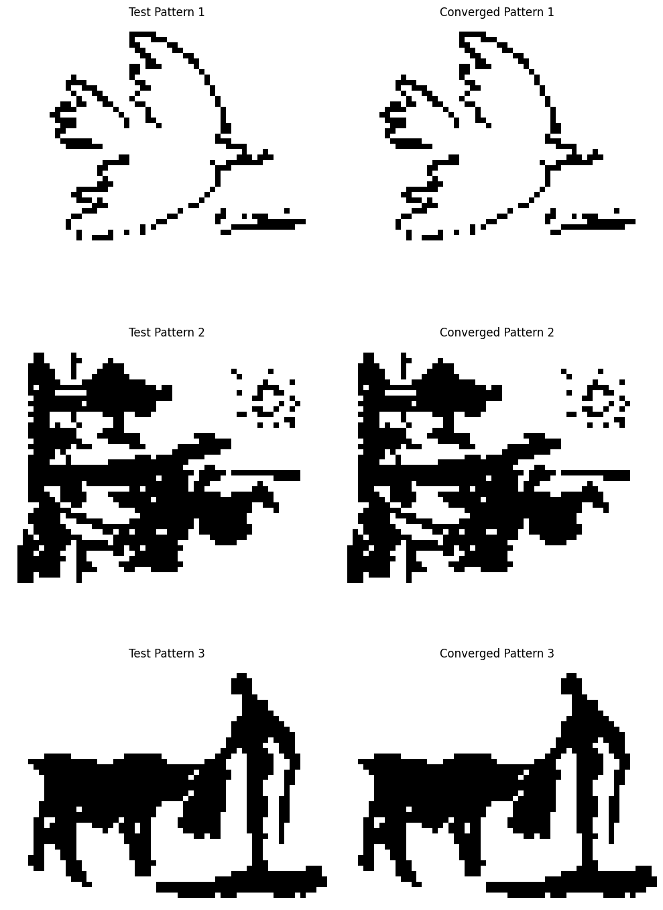

<center>

#### Resultados Batch 50x50

</center>


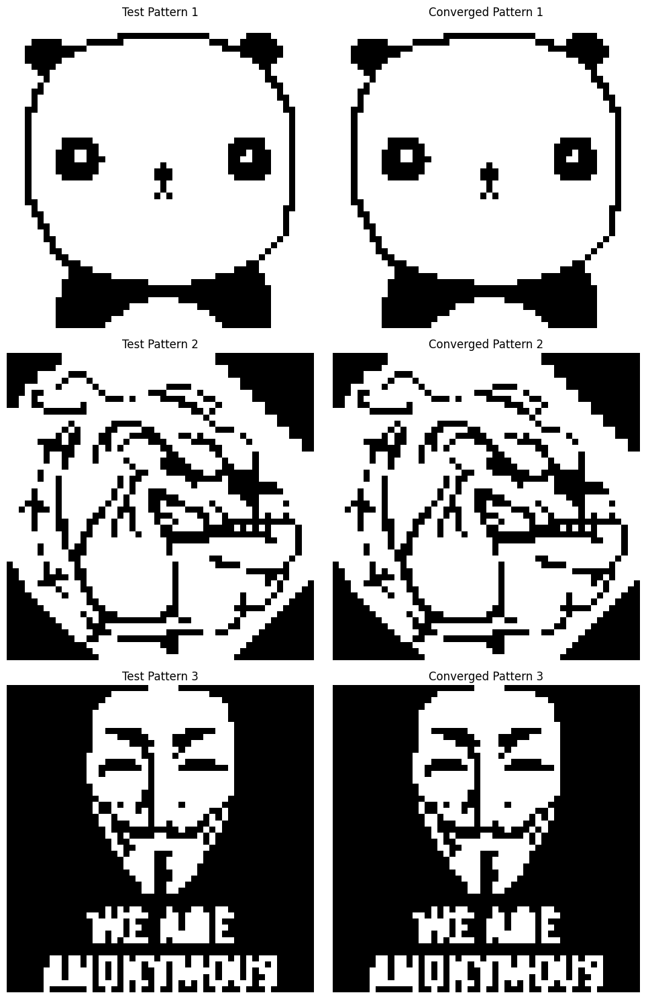


- Donde se ve que la red, una vez entrenada, converge perfectamente a los patrones de entrada (para cada batch respectivamente).

## B. Prueba con Patrones Ruidosos  

- Considerando el batch 45x60, vamos a añadir ruido a las imágenes y testear cómo se comporta la red. 

- La primera prueba involucra añadir ruido aleatorio a los patrones antes de testear la red

```py

def add_random_noise(pattern, noise_level):
    noisy_pattern = pattern.copy()
    num_noise = int(noise_level * noisy_pattern.size)
    indices = np.random.choice(noisy_pattern.size, num_noise, replace=False)
    noisy_pattern.flat[indices] *= -1
    return noisy_pattern

```

- Los resultados se muestran a continuación para niveles de ruido de 10%, 30% y 50% respectivamente.


<center>

## 10%

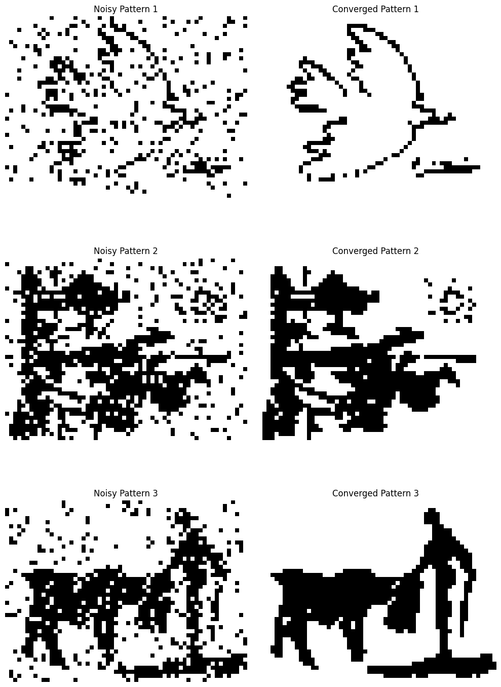

## 30%

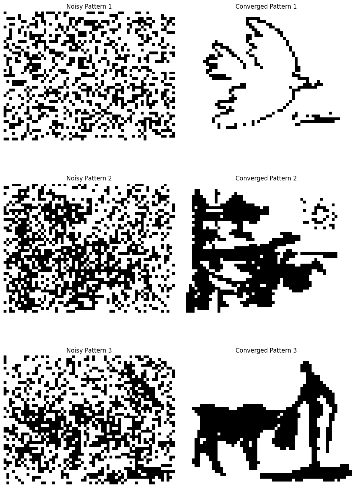

## 50%

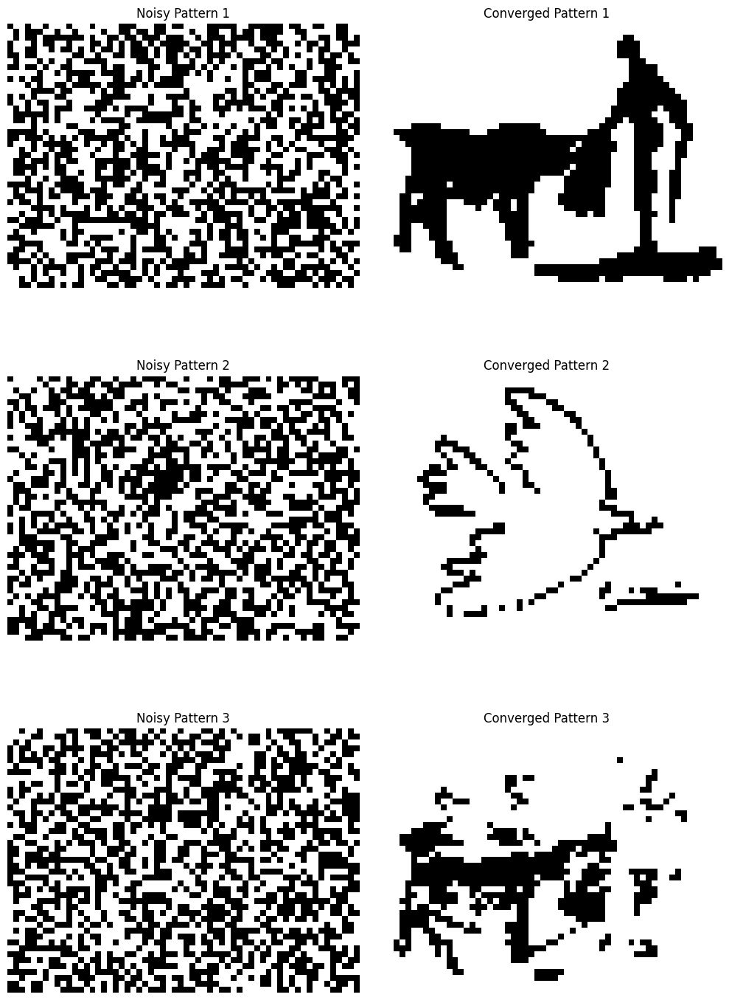

</center>
 

- Se observa que la red mantiene una notable robustez frente al ruido, siendo precisamente el umbral de el 50% el que comienza a afectar la capacidad de la red para recuperar los patrones originales (lo que se condice con el hecho de que estamos generando ruido aleatorio), generando errores de clasificación y estados espureos.

- La segunda prueba involucra poner la mitad de la imágen en blanco y la tercera ponerla en negro. En este caso, se espera que las imágenes cuyos pixeles predominantes sean blancos y negros respectivamente para cada caso puedan reconstruirse exitosamente. Observamos que este es en efecto el caso: La imágen de la paloma, donde predomina el blanco en ese lado de la imágen, se reconstruye para el caso de una mitad blanca pero no para la mitad negra. El caso es exactamente inverso para el quijote, donde predomina el negro en esa parte de la imágen. 

```py

def turn_pattern_half_white(pattern):
    half_white_pattern = pattern.copy()
    half_white_pattern[:, :pattern.shape[1]//2] = -1
    return half_white_pattern

def turn_pattern_half_black(pattern):
    half_black_pattern = pattern.copy()
    half_black_pattern[:, :pattern.shape[1]//2] = 1
    return half_black_pattern

```

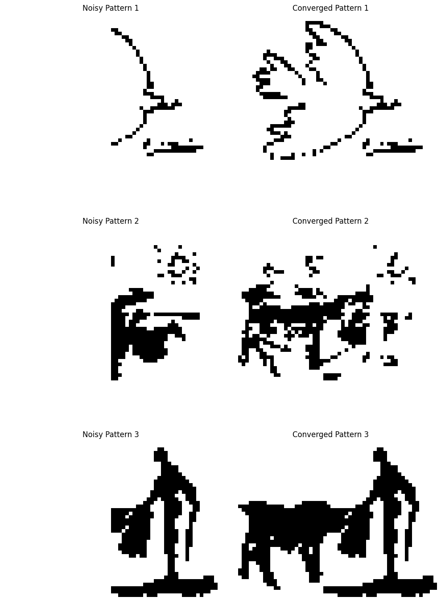
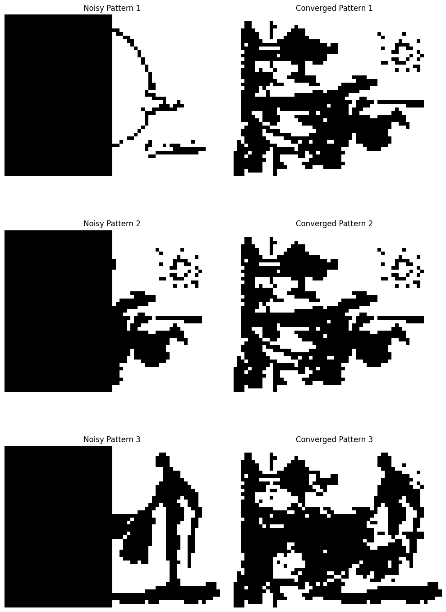

## C. Evaluación de Estados Espureos

- El extracto del libro menciona dos tipos comúnes de estados espureos. El primero se corresponde a invertir el patrón de entrada (llevar los píxeles blancos a negro y viceversa), el cual lleva a una configuración estable como efectivamente verificamos en nuestro proyecto. 

```py
def reverse_black_white(pattern):
    return np.where(pattern == 1, -1, 1)
```

<center>

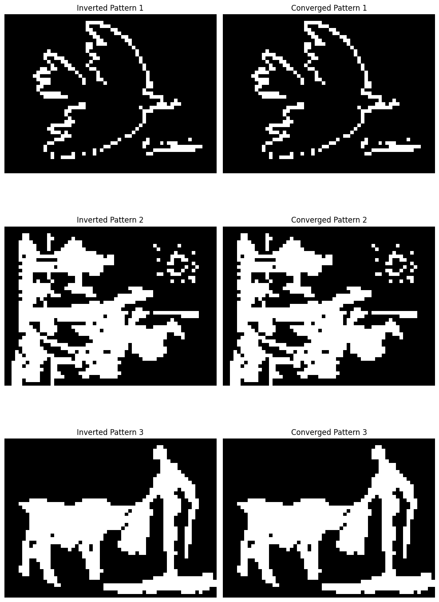

</center>

- El segundo consiste en una combinación lineal de los patrones. Esto también se verifica en nuestro proyecto. 

```py

linear_combination_of_patterns = np.sum(images_45_60_np, axis=0)/len(images_45_60_np)

output_pattern = network.predict(linear_combination_of_patterns)

def plot_image(ax, img, title):
    ax.imshow(img.reshape(45, 60), cmap='gray')
    ax.set_title(title)
    ax.axis('off')

fig, axes = plt.subplots(1, 2, figsize=(12, 6))

plot_image(axes[0], linear_combination_of_patterns, 'Linear Combination of Patterns')
plot_image(axes[1], output_pattern, 'Output Pattern (Spurious State)')

```

<center>

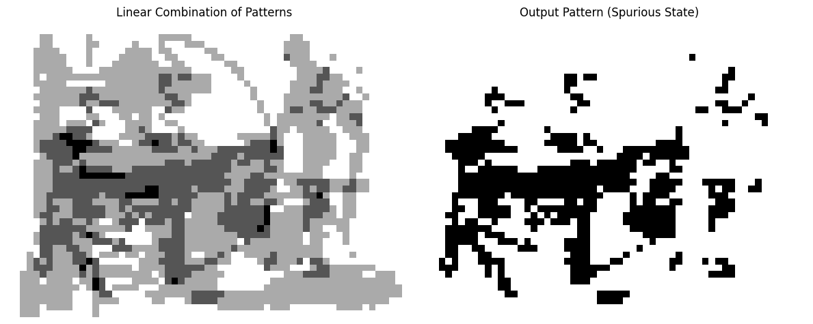

</center>


## D. Entrenamiento con 6 imágenes

- Vamos a valernos de una herramienta de la biblioteca Pillow para redimensionar una imágen .bmp conservando el aspect-ratio. Haciendo esto, llevamos todas las imágenes a el mismo tamaño 60x60

```py

from PIL import Image
import os

def resize_and_pad_image(image_name, target_size):
    with Image.open(image_name) as img:
        # Calculate the aspect ratio and new dimensions
        img_ratio = img.width / img.height
        target_ratio = target_size[0] / target_size[1]

        if img_ratio > target_ratio:
            # Wider image, scale by width
            new_width = target_size[0]
            new_height = int(new_width / img_ratio)
        else:
            # Taller image, scale by height
            new_height = target_size[1]
            new_width = int(new_height * img_ratio)

        # Resize the image while keeping aspect ratio
        resized_img = img.resize((new_width, new_height), Image.Resampling.LANCZOS)

        # Create a white background image of target size
        new_img = Image.new("RGB", target_size, (255, 255, 255))

        # Calculate top-left corner to paste the resized image centered
        paste_x = (target_size[0] - new_width) // 2
        paste_y = (target_size[1] - new_height) // 2

        # Paste the resized image onto the white background
        new_img.paste(resized_img, (paste_x, paste_y))

        # Save the result
        new_img.save(f"resized_{image_name}")

target_size = (60, 60)  # Define target size

# Resize all .bmp images in the directory
for image in images:
    resize_and_pad_image(image, target_size)


```

- Ahora, vamos a entrenar la red con las 6 imágenes y testearla con las imágenes de 60x60. 

```py

# Crear Batch de Imágenes de 60x60
images_60 = [f for f in os.listdir('.') if f.startswith('resized_') and f.endswith('.bmp')]
images_60_np = []

for image in images_60:
    img = Image.open(image).convert('L')
    img_array = np.array(img)
    binary_array = np.where(img_array > 127, 1, -1)
    images_60_np.append(binary_array)

input_patterns = images_60_np.copy()
network = HopfieldNetwork()
network.train(input_patterns)

output_patterns = [network.predict(pattern, synchronous=True) for pattern in input_patterns]

fig, axes = plt.subplots(6, 2, figsize=(10, 15))

for i in range(6):
    axes[i, 0].imshow(input_patterns[i].reshape(60, 60), cmap='gray')
    axes[i, 0].set_title(f'Input Pattern {i+1}')
    axes[i, 0].axis('off')
    
    axes[i, 1].imshow(output_patterns[i].reshape(60, 60), cmap='gray')
    axes[i, 1].set_title(f'Output Pattern {i+1}')
    axes[i, 1].axis('off')

plt.tight_layout()

plt.show()

```

- Los resultados se muestran a continuación.

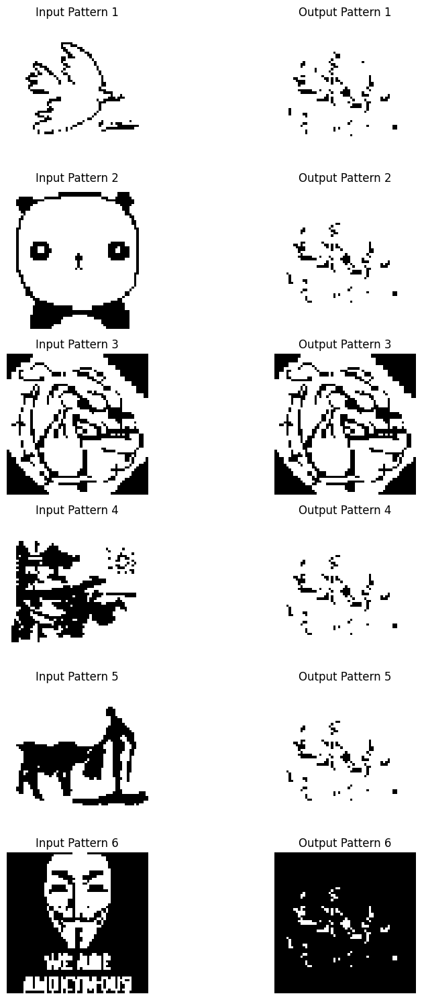

- El hecho de que que incluso cuando el patrón con el que la red fue entrenada se toma como input esta no logra reconstruirlo correctamente evidencia una clara ***inestabilidad*** en la red. 

- La red de Hopfield tiene una capacidad máxima de almacenamiento de aproximadamente 0.14N, donde N es el número de neuronas. En este caso, N=3600, por lo que la red debería ser, en teoría, capaz de almacenar cientos de patrones.

- Dado esto, hipotetizamos que los supuestos de aleatoriedad en los patrones que se utilizan para tener la fórmula de la capacidad son claramente inaplicables (dada la alta correlación entre los píxeles de una imágen con si misma así como la correlación entre los píxeles de una imágen con los de otra). La capacidad *real* de la red a los propositos de reconstrucción de imágenes *con significado* (esto es, para el ojo humano), entonces, se encuentra bién por debajo de la teórica, y dada la cantidad de estados espureos que esta puede almacenar, no resulta del todo insólito que las 6 imágenes no puedan almacenarse. 


<center>

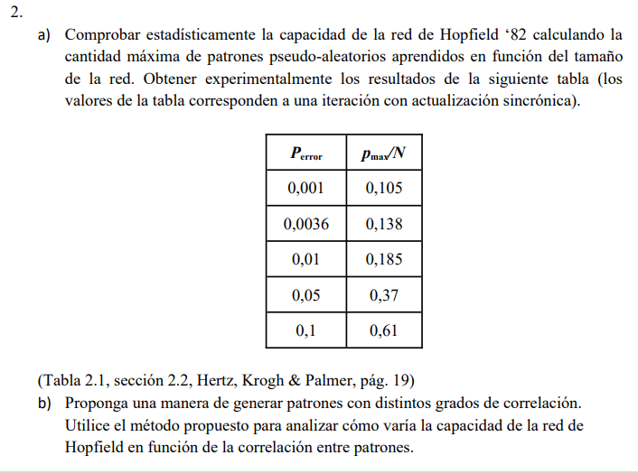

</center>

## Introducción

La capacidad de la red de Hopfield se define como la cantidad máxima de patrones que pueden aprenderse sobre la totalidad de las neuronas de la red.

<center>

$C=\frac{P_{max}}{N}$

</center>

En base a la tabla de arriba, es justo asumir que para una iteración sincrónica, una red de hopfield de $N=100$ neuronas puede almacenar aproximadamente 14 patrones con una tasa de error de recuperación despreciable ($P(E).N < 1$), sujeto, claro esta, al supuesto de pseudo-aleatoriedad de estos patrones. 

La tasa de error puede estimarse como la cantidad de errores de clasificación dividido por el producto de la cantidad de patrones y de neuronas

$$P(E)=\frac{\# E}{N.M}$$

Así, por ejemplo, podemos tener 3 patrones y 4 neuronas 


<center>

| $P_1$  | $P_2$ | $P_3$ |
| --- | --- | --- |
| 1 | -1 | -1 |
| -1 | 1 | -1 |
| -1 | 1 | 1 |
| 1 | -1 | 1 |

</center>

Supongamos que después de actualizar tengo


<center>

| $P_1$  | $P_2$ | $P_3$ |
| --- | --- | --- |
| 1 | -1 | **<font color='red'>1</font>** |
| **<font color='red'>1</font>** | **<font color='red'>-1</font>** | **<font color='red'>1</font>** |
| -1 | 1 | 1 |
| 1 | -1 | 1 |

</center>

Notamos la cantidad de errores cometidos. En este caso: $\frac{4}{12} = \frac{1}{3}$.

En adelante proponemos un $N=100$, que nos otorga una red lo suficientemente grande para obtener resultados significativos, al tiempo que no es tan grande como para que el entrenamiento sea computacionalmente prohibitivo.

## Verificación de la Tabla de la Consigna


Comenzamos por verificar los resultados de la tabla. Esto se hace sencillamente a partir del siguiente algoritmo. 

```py
# Número de Neuronas (tamaño del patrón)
N=100

E_values = []
C_values = []

# Incrementamos gradualmente la cantidad de patrones a aprender
for M in range(1,1000):
    # Los patrones son vectores aleatorios de numpy
    patterns = []
    for i in range(M):
        patterns.append(np.random.choice([-1, 1], size=N))
    # Red de hopfield modificada 
    # (no importa la 'shape' de los patrones)
    # También se pone en una iteración sincrónica por defecto
    hopfield = HopfieldNetworkv2()
    # Entrenamos la red
    hopfield.train(patterns) 
    # Encontramos el error de clasificación total
    ET = 0 
    for pattern in patterns:
        # Sum 1 to E for each element that differs between vectors
        ET += np.sum(pattern != hopfield.predict(pattern))
    # Obtenemos la tasa de error y la capacidad para este tamaño de patrón
    E = ET/(N*M)
    C = M/N
    E_values.append(E)
    C_values.append(C)

# Plot E vs C
plt.scatter(E_values, C_values)
plt.xlabel('E')
plt.ylabel('C')
plt.title('E vs C')
plt.xlim(0, 0.1)
plt.ylim(0, 1)
plt.show()


```

<center>

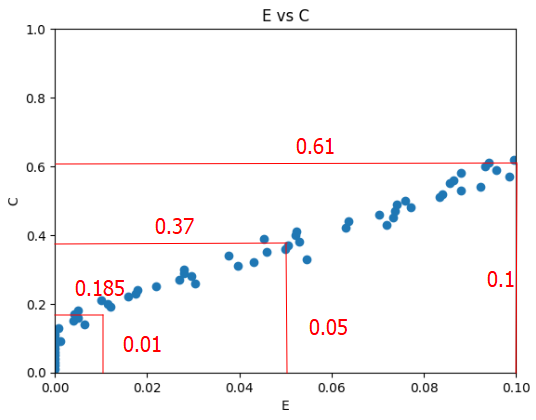

</center>

Donde esta claro que se corroboran los valores de la tabla de la consigna.

## Verificación de Capacidad

Por otro lado, esta claro que para un N fijo, la tasa de error impone un límite a la cantidad de patrones que pueden aprenderse. Queremos saber cual es la cantidad de patrones máximos que mantienen una tasa de error inferior a 0.01 en función de la cantidad de neuronas. Dado lo que sabemos de la capacidad de la red de Hopfield como independiente de el número de neuronas, es justo asumir que la relación entre la cantidad de patrones y la cantidad de neuronas es lineal. 

```py

C_values = []
# Variación en la cantidad de neuronas de 5 a 500
for N in range(5,500):
    for M in range(1,1000):
        # Idem para el resto del algoritmo
        patterns = []
        for i in range(M):
            patterns.append(np.random.choice([-1, 1], size=N))

        hopfield = HopfieldNetworkv2()
        hopfield.train(patterns)  
        ET = 0 
        for pattern in patterns:
            ET += np.sum(pattern != hopfield.predict(pattern))

        E = ET/(N*M)
        C = M/N

        # Detenemos la ejecución y registramos la capacidad
        # Cuando la tasa de error supera el 1%
        if (E > 0.01):
            print(f"N: {N}, M: {M}, E: {E}, C: {C}")            
            C_values.append({'N': N, 'M': M, 'C': C})
            break

C_values = pd.DataFrame(C_values)

# Ploteamos la cantidad de patrones en función de las neuronas
plt.scatter(C_values['N'], C_values['M'])
plt.xlabel('Número de Neuronas (N)')
plt.ylabel('Patrones Seudoaleatorios Aprendidos(M)')
plt.title('Patrones Aprendidos en función de las Neuronas')
plt.show()

```

<center>

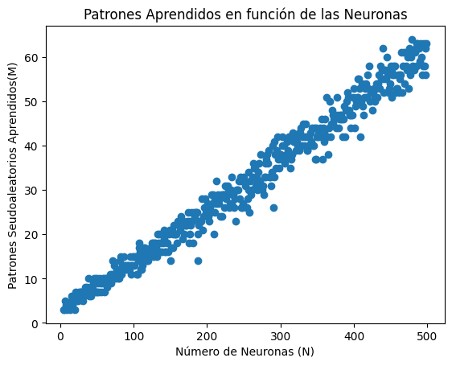

</center>

Donde se ve que la relación entre la cantidad de patrones y la cantidad de neuronas es lineal, aunque la capacidad no resulta tener un valor exactamente fijo como el obtenido teóricamente. 

## Variación en Función de la Correlación

Esta claro que la correlación entre patrones afecta directamente la capacidad de almacenamiento de la red de Hopfield. Patrones altamente correlacionados (es decir, similares entre sí) son más difíciles de almacenar correctamente porque pueden interferir unos con otros durante la recuperación (contribuyen a la uniformidad de la función de energía).

Para crear nuevos patrones con un grado de correlación específico, se puede partir de un patrón base y generar $M$ patrones con un grado de correlación $r=\{0,...,1\}$. Esto se hace designando un operador que invierta la activación de la neurona con una probabilidad $p=0.5-\frac{r}{2}$. De este modo, para una correlación nula $r=0$, los patrones son completamente aleatorios. Para una correlación máxima, $r=1$, los patrones son idénticos. 

Definimos entonces una función `random_patterns(M,N,r)` que genere $M$ patrones de tamaño $N$ con un grado de correlación $r$ entre ellos. 

```py 

def random_patterns(M, N, r):
    # Patrón base
    base_pattern = np.random.choice([-1, 1], size=N)
    patterns = [base_pattern]
    for i in range(1, M):
        # Generar un patrón con correlación r con el patrón base
        pattern = base_pattern.copy()
        for j in range(N):
            # Invertir la activación de la neurona con probabilidad p
            p = 0.5 - r/2
            if np.random.rand() < p:
                pattern[j] *= -1
        patterns.append(pattern)
    return patterns

```

Procedemos a corroborar cómo varía la capacidad en función de la correlación. Tomamos $N=100$ y ploteamos la cantidad de patrones máximos que pueden aprenderse en función de la correlación. 

```py
C_values = []
# Variación en la correlación de 0 a 1
for r in np.linspace(0, 1, 100):
    for M in range(1,100):
        patterns = random_patterns(M, 100, r)

        hopfield = HopfieldNetworkv2()
        hopfield.train(patterns)  
        ET = 0 
        for pattern in patterns:
            ET += np.sum(pattern != hopfield.predict(pattern))

        E = ET/(100*M)
        C = M/100

        if (E > 0.01):
            print(f"r: {r}, M: {M}, E: {E}, C: {C}")            
            C_values.append({'r': r, 'M': M, 'C': C})
            break

# ploteamos la cantidad de patrones en función de la correlación
C_values = pd.DataFrame(C_values)
plt.scatter(C_values['C'], C_values['M'])
plt.xlabel('Correlación (r)')
plt.ylabel('Capacidad(C)')
plt.title('Patrones Aprendidos en función de la Correlación')
plt.show()
```

<center>

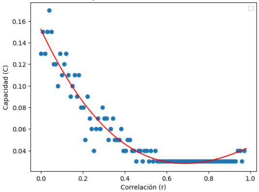

</center>

Donde se ve claramente que, como esperábamos, la capacidad decrece violentamente en función de la correlación, volviendose exactamente nula para una correlación superior a 0.5. 